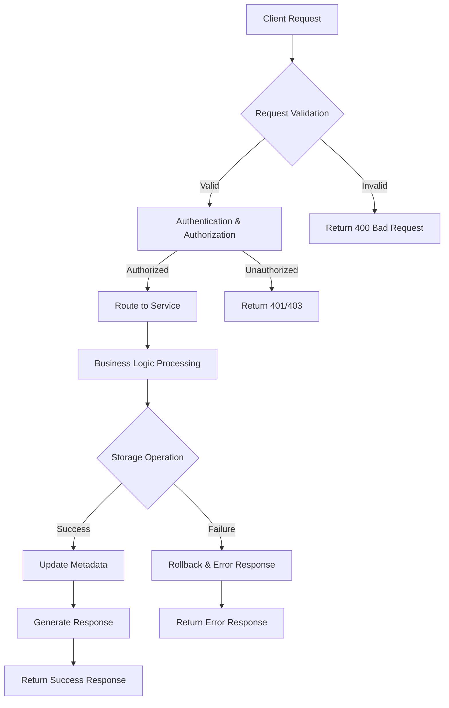

## System Overview

### Vision
Design a scalable, extensible file storage service that abstracts multiple storage backends (HDFS, NFS) through a unified interface, providing seamless file operations for distributed applications.

### Key Design Principles
- **Pluggability**: SPI-based driver architecture for easy backend integration
- **Scalability**: Handle millions of files with horizontal scaling
- **Reliability**: 99.9% availability with fault tolerance
- **Performance**: Sub-second response times for file operations
- **Security**: Enterprise-grade access control and encryption

### High-Level Architecture


    Client[Client Applications] --> SDK[FileSystem SDK]
    SDK --> LB[Load Balancer]
    LB --> API[File Storage API Gateway]
    
    API --> Service[FileStorageService]
    Service --> SPI[SPI Framework]
    
    SPI --> HDFS[HDFS Driver]
    SPI --> NFS[NFS Driver]
    SPI --> S3[S3 Driver]
    
    HDFS --> HDFSCluster[HDFS Cluster]
    NFS --> NFSServer[NFS Server]
    S3 --> S3Bucket[S3 Storage]
    
    Service --> Cache[Redis Cache]
    Service --> DB[Metadata DB]
    Service --> MQ[Message Queue]


**💡 Interview Insight**: *When discussing system architecture, emphasize the separation of concerns - API layer handles routing and validation, service layer manages business logic, and SPI layer provides storage abstraction. This demonstrates understanding of layered architecture patterns.*

---

## Architecture Design

### Component Interaction Flow


    participant Client
    participant SDK
    participant Gateway
    participant FileService
    participant SPI
    participant Storage
    participant MetadataDB
    
    Client->>SDK: uploadFile(file, metadata)
    SDK->>Gateway: POST /files/upload
    Gateway->>FileService: processUpload()
    FileService->>SPI: store(fileData)
    SPI->>Storage: writeFile()
    Storage-->>SPI: fileLocation
    SPI-->>FileService: storageResult
    FileService->>MetadataDB: saveMetadata()
    FileService-->>Gateway: uploadResponse
    Gateway-->>SDK: HTTP 201 + fileUrl
    SDK-->>Client: FileUploadResult


### Design Patterns Applied

1. **Strategy Pattern**: SPI drivers implement different storage strategies
2. **Factory Pattern**: Driver creation based on configuration
3. **Template Method**: Common file operations with backend-specific implementations
4. **Circuit Breaker**: Fault tolerance for external storage systems
5. **Observer Pattern**: Event-driven notifications for file operations

**💡 Interview Insight**: *Discussing design patterns shows architectural maturity. Mention how the Strategy pattern enables runtime switching between storage backends without code changes, which is crucial for multi-cloud deployments.*

---

## Core Components

### 1. FileStorageService

The central orchestrator managing all file operations:

```java
@Service
public class FileStorageService {
    
    @Autowired
    private FileSystemSPIManager spiManager;
    
    @Autowired
    private MetadataRepository metadataRepo;
    
    @Autowired
    private CacheManager cacheManager;
    
    public FileUploadResult uploadFile(FileUploadRequest request) {
        // 1. Validate file and metadata
        validateFile(request.getFile());
        
        // 2. Generate unique file ID
        String fileId = generateFileId();
        
        // 3. Determine storage backend based on policy
        String driverType = determineStorageBackend(request);
        FileSystemDriver driver = spiManager.getDriver(driverType);
        
        // 4. Store file using appropriate driver
        StorageResult result = driver.store(fileId, request.getFile());
        
        // 5. Save metadata
        FileMetadata metadata = createMetadata(fileId, request, result);
        metadataRepo.save(metadata);
        
        // 6. Cache metadata for quick access
        cacheManager.put(fileId, metadata);
        
        // 7. Generate download URL
        String downloadUrl = generateDownloadUrl(fileId);
        
        return new FileUploadResult(fileId, downloadUrl, metadata);
    }
    
    public FileDownloadResult downloadFile(String fileId) {
        // Implementation with caching and fallback strategies
    }
}
```

### 2. Metadata Management


    FILE_METADATA {
        string file_id PK
        string original_name
        string content_type
        long file_size
        string storage_backend
        string storage_path
        string checksum
        timestamp created_at
        timestamp updated_at
        string created_by
        json custom_attributes
        enum status
    }
    
    FILE_ACCESS_LOG {
        string log_id PK
        string file_id FK
        string operation_type
        string client_ip
        timestamp access_time
        boolean success
        string error_message
    }
    
    STORAGE_QUOTA {
        string tenant_id PK
        long total_quota
        long used_space
        long file_count
        timestamp last_updated
    }


**💡 Interview Insight**: *Metadata design is crucial for system scalability. Discuss partitioning strategies - file_id can be hash-partitioned, and time-based partitioning for access logs enables efficient historical data management.*

---

## SPI Framework Implementation

### SPI Architecture


    class FileSystemDriver {
        <<interface>>
        +store(fileId, fileData) StorageResult
        +retrieve(fileId) FileData
        +delete(fileId) boolean
        +exists(fileId) boolean
        +generateDownloadUrl(fileId) String
    }
    
    class HDFSDriver {
        -hdfsConfig: Configuration
        -fileSystem: FileSystem
        +store(fileId, fileData) StorageResult
        +retrieve(fileId) FileData
    }
    
    class NFSDriver {
        -nfsConfig: NFSConfig
        -mountPoint: String
        +store(fileId, fileData) StorageResult
        +retrieve(fileId) FileData
    }
    
    class S3Driver {
        -s3Client: AmazonS3
        -bucketName: String
        +store(fileId, fileData) StorageResult
        +retrieve(fileId) FileData
    }
    
    class DriverFactory {
        +createDriver(driverType) FileSystemDriver
    }
    
    class SPIManager {
        -drivers: Map~String,FileSystemDriver~
        +getDriver(type) FileSystemDriver
        +registerDriver(type, driver)
    }
    
    FileSystemDriver <|-- HDFSDriver
    FileSystemDriver <|-- NFSDriver
    FileSystemDriver <|-- S3Driver
    DriverFactory --> FileSystemDriver
    SPIManager --> FileSystemDriver


### SPI Configuration

```java
// META-INF/services/com.fileservice.spi.FileSystemDriver
com.fileservice.driver.HDFSDriver
com.fileservice.driver.NFSDriver
com.fileservice.driver.S3Driver

@Component
public class FileSystemSPIManager {
    
    private final Map<String, FileSystemDriver> drivers = new ConcurrentHashMap<>();
    
    @PostConstruct
    public void initializeDrivers() {
        ServiceLoader<FileSystemDriver> loader = 
            ServiceLoader.load(FileSystemDriver.class);
        
        for (FileSystemDriver driver : loader) {
            String driverType = driver.getDriverType();
            drivers.put(driverType, driver);
            logger.info("Registered driver: {}", driverType);
        }
    }
    
    public FileSystemDriver getDriver(String driverType) {
        FileSystemDriver driver = drivers.get(driverType);
        if (driver == null) {
            throw new UnsupportedDriverException("Driver not found: " + driverType);
        }
        return driver;
    }
}
```

**💡 Interview Insight**: *SPI demonstrates understanding of extensibility patterns. Mention that this approach allows adding new storage backends without modifying core service code, following the Open-Closed Principle.*

---

## API Design

### RESTful API Endpoints

```yaml
openapi: 3.0.0
info:
  title: File Storage Service API
  version: 1.0.0

paths:
  /api/v1/files:
    post:
      summary: Upload file
      requestBody:
        content:
          multipart/form-data:
            schema:
              type: object
              properties:
                file:
                  type: string
                  format: binary
                metadata:
                  type: object
                storagePreference:
                  type: string
                  enum: [hdfs, nfs, s3]
      responses:
        '201':
          description: File uploaded successfully
          content:
            application/json:
              schema:
                $ref: '#/components/schemas/FileUploadResponse'
    
    get:
      summary: List files with pagination
      parameters:
        - name: page
          in: query
          schema:
            type: integer
        - name: size
          in: query
          schema:
            type: integer
        - name: filter
          in: query
          schema:
            type: string
      responses:
        '200':
          description: Files retrieved successfully

  /api/v1/files/{fileId}:
    get:
      summary: Get file metadata
      parameters:
        - name: fileId
          in: path
          required: true
          schema:
            type: string
      responses:
        '200':
          description: File metadata retrieved
    
    delete:
      summary: Delete file
      responses:
        '204':
          description: File deleted successfully

  /api/v1/files/{fileId}/download:
    get:
      summary: Download file
      responses:
        '200':
          description: File content
          content:
            application/octet-stream:
              schema:
                type: string
                format: binary

components:
  schemas:
    FileUploadResponse:
      type: object
      properties:
        fileId:
          type: string
        downloadUrl:
          type: string
        metadata:
          $ref: '#/components/schemas/FileMetadata'
```

### Request/Response Flow



**💡 Interview Insight**: *API design considerations include idempotency for upload operations, proper HTTP status codes, and consistent error response format. Discuss rate limiting and API versioning strategies for production systems.*

---

## Client SDK

### SDK Architecture

```java
public class FileStorageClient {
    
    private final String baseUrl;
    private final HttpClient httpClient;
    private final AuthenticationProvider authProvider;
    private final RetryPolicy retryPolicy;
    
    public FileStorageClient(FileStorageConfig config) {
        this.baseUrl = config.getBaseUrl();
        this.httpClient = createHttpClient(config);
        this.authProvider = new AuthenticationProvider(config);
        this.retryPolicy = RetryPolicy.exponentialBackoff();
    }
    
    public CompletableFuture<FileUploadResult> uploadFileAsync(
            String filePath, 
            FileUploadOptions options) {
        
        return CompletableFuture.supplyAsync(() -> {
            try {
                return uploadFileInternal(filePath, options);
            } catch (Exception e) {
                throw new FileStorageException("Upload failed", e);
            }
        });
    }
    
    public FileDownloadResult downloadFile(String fileId, String destPath) {
        return retryPolicy.execute(() -> {
            HttpRequest request = buildDownloadRequest(fileId);
            HttpResponse<byte[]> response = httpClient.send(request, 
                HttpResponse.BodyHandlers.ofByteArray());
            
            if (response.statusCode() == 200) {
                Files.write(Paths.get(destPath), response.body());
                return new FileDownloadResult(fileId, destPath);
            } else {
                throw new FileStorageException("Download failed: " + response.statusCode());
            }
        });
    }
}
```

### SDK Features

1. **Async Operations**: Non-blocking file operations
2. **Retry Logic**: Exponential backoff with jitter
3. **Progress Tracking**: Upload/download progress callbacks
4. **Connection Pooling**: Efficient HTTP connection management
5. **Error Handling**: Comprehensive exception hierarchy

```java
// Usage Example
FileStorageClient client = new FileStorageClient(config);

// Async upload with progress tracking
CompletableFuture<FileUploadResult> future = client.uploadFileAsync(
    "large-file.zip",
    FileUploadOptions.builder()
        .storageBackend("hdfs")
        .progressCallback(progress -> 
            System.out.println("Upload progress: " + progress.getPercentage() + "%"))
        .build()
);

future.thenAccept(result -> {
    System.out.println("File uploaded: " + result.getDownloadUrl());
});
```

**💡 Interview Insight**: *SDK design demonstrates client-side engineering skills. Discuss thread safety, connection pooling, and how to handle large file uploads with chunking and resume capabilities.*

---

## Storage Backends

### HDFS Integration

```java
@Component
public class HDFSDriver implements FileSystemDriver {
    
    private final FileSystem hdfsFileSystem;
    private final Configuration hadoopConfig;
    
    @Override
    public StorageResult store(String fileId, FileData fileData) {
        Path hdfsPath = new Path("/fileservice/" + generatePath(fileId));
        
        try (FSDataOutputStream outputStream = hdfsFileSystem.create(hdfsPath)) {
            IOUtils.copyBytes(fileData.getInputStream(), outputStream, 4096, false);
            
            FileStatus fileStatus = hdfsFileSystem.getFileStatus(hdfsPath);
            
            return StorageResult.builder()
                .fileId(fileId)
                .storagePath(hdfsPath.toString())
                .size(fileStatus.getLen())
                .checksum(calculateChecksum(fileData))
                .build();
                
        } catch (IOException e) {
            throw new StorageException("HDFS store failed", e);
        }
    }
    
    @Override
    public FileData retrieve(String fileId) {
        Path hdfsPath = getPathFromFileId(fileId);
        
        try {
            FSDataInputStream inputStream = hdfsFileSystem.open(hdfsPath);
            return new FileData(inputStream, hdfsFileSystem.getFileStatus(hdfsPath).getLen());
        } catch (IOException e) {
            throw new StorageException("HDFS retrieve failed", e);
        }
    }
    
    private String generatePath(String fileId) {
        // Generate hierarchical path: /2023/12/15/abc123...
        return String.format("%s/%s/%s/%s", 
            LocalDate.now().getYear(),
            LocalDate.now().getMonthValue(),
            LocalDate.now().getDayOfMonth(),
            fileId);
    }
}
```

### NFS Integration

```java
@Component  
public class NFSDriver implements FileSystemDriver {
    
    private final String mountPoint;
    private final FileSystem nfsFileSystem;
    
    @Override
    public StorageResult store(String fileId, FileData fileData) {
        Path nfsPath = Paths.get(mountPoint, generatePath(fileId));
        
        try {
            Files.createDirectories(nfsPath.getParent());
            
            try (InputStream input = fileData.getInputStream();
                 OutputStream output = Files.newOutputStream(nfsPath)) {
                
                long bytesTransferred = input.transferTo(output);
                
                return StorageResult.builder()
                    .fileId(fileId)
                    .storagePath(nfsPath.toString())
                    .size(bytesTransferred)
                    .checksum(calculateChecksum(nfsPath))
                    .build();
            }
        } catch (IOException e) {
            throw new StorageException("NFS store failed", e);
        }
    }
}
```

### Storage Selection Strategy


    A[File Upload Request] --> B{File Size Check}
    B -->|< 100MB| C{Performance Priority?}
    B -->|> 100MB| D{Durability Priority?}
    
    C -->|Yes| E[NFS - Low Latency]
    C -->|No| F[HDFS - Cost Effective]
    
    D -->|Yes| G[HDFS - Replication]
    D -->|No| H[S3 - Archival]
    
    E --> I[Store in NFS]
    F --> J[Store in HDFS]
    G --> J
    H --> K[Store in S3]


**💡 Interview Insight**: *Storage selection demonstrates understanding of trade-offs. NFS offers low latency but limited scalability, HDFS provides distributed storage with replication, S3 offers infinite scale but higher latency. Discuss when to use each based on access patterns.*

---

## Security & Performance

### Security Implementation

```java
@RestController
@RequestMapping("/api/v1/files")
@PreAuthorize("hasRole('FILE_USER')")
public class FileController {
    
    @PostMapping(consumes = MediaType.MULTIPART_FORM_DATA_VALUE)
    @PreAuthorize("@fileSecurityService.canUpload(authentication.name, #request.storageBackend)")
    public ResponseEntity<FileUploadResponse> uploadFile(
            @RequestParam("file") MultipartFile file,
            @RequestParam("metadata") String metadata,
            FileUploadRequest request) {
        
        // Validate file type and size
        fileValidationService.validateFile(file);
        
        // Scan for malware
        if (!malwareScanService.isFileSafe(file)) {
            throw new SecurityException("File failed security scan");
        }
        
        FileUploadResult result = fileStorageService.uploadFile(request);
        return ResponseEntity.status(HttpStatus.CREATED).body(result);
    }
}

@Service
public class FileSecurityService {
    
    public boolean canUpload(String username, String storageBackend) {
        UserPermissions permissions = userService.getPermissions(username);
        return permissions.hasStorageAccess(storageBackend);
    }
    
    public String generateSignedUrl(String fileId, Duration expiry) {
        String token = jwtService.createToken(
            Map.of("fileId", fileId, "action", "download"),
            expiry
        );
        return baseUrl + "/files/" + fileId + "/download?token=" + token;
    }
}
```

### Performance Optimizations

1. **Connection Pooling**: HTTP and database connection pools
2. **Caching Strategy**: Multi-level caching (Redis + Local)
3. **Async Processing**: Non-blocking I/O operations
4. **Compression**: Automatic compression for large files
5. **CDN Integration**: Geographic distribution for downloads

```java
@Configuration
public class PerformanceConfig {
    
    @Bean
    public ThreadPoolTaskExecutor fileProcessingExecutor() {
        ThreadPoolTaskExecutor executor = new ThreadPoolTaskExecutor();
        executor.setCorePoolSize(10);
        executor.setMaxPoolSize(50);
        executor.setQueueCapacity(100);
        executor.setThreadNamePrefix("file-processor-");
        return executor;
    }
    
    @Bean
    public CacheManager cacheManager() {
        RedisCacheManager.Builder builder = RedisCacheManager
            .RedisCacheManagerBuilder
            .fromConnectionFactory(redisConnectionFactory())
            .cacheDefaults(cacheConfiguration());
        return builder.build();
    }
}
```

**💡 Interview Insight**: *Performance discussions should cover caching strategies (what to cache, cache invalidation), connection pooling, and async processing. Mention specific metrics like P99 latency targets and throughput requirements.*

---

## Monitoring & Operations

### Metrics and Monitoring

```java
@Component
public class FileStorageMetrics {
    
    private final Counter uploadCounter = Counter.builder("file.uploads.total")
        .description("Total file uploads")
        .tag("storage_backend", "")
        .register(Metrics.globalRegistry);
    
    private final Timer uploadTimer = Timer.builder("file.upload.duration")
        .description("File upload duration")
        .register(Metrics.globalRegistry);
    
    private final Gauge storageUsage = Gauge.builder("storage.usage.bytes")
        .description("Storage usage by backend")
        .tag("backend", "")
        .register(Metrics.globalRegistry, this, FileStorageMetrics::getStorageUsage);
    
    public void recordUpload(String backend, Duration duration) {
        uploadCounter.increment(Tags.of("storage_backend", backend));
        uploadTimer.record(duration);
    }
}
```

### Health Checks

```java
@Component
public class FileStorageHealthIndicator implements HealthIndicator {
    
    @Override
    public Health health() {
        Health.Builder status = new Health.Builder();
        
        // Check storage backends
        for (String backend : spiManager.getAvailableBackends()) {
            try {
                FileSystemDriver driver = spiManager.getDriver(backend);
                boolean healthy = driver.healthCheck();
                status.withDetail(backend, healthy ? "UP" : "DOWN");
            } catch (Exception e) {
                status.withDetail(backend, "ERROR: " + e.getMessage());
            }
        }
        
        return status.up().build();
    }
}
```

### Observability Dashboard


    subgraph "Application Metrics"
        A[Upload Rate]
        B[Download Rate]
        C[Error Rate]
        D[Response Time]
    end
    
    subgraph "Infrastructure Metrics"
        E[CPU Usage]
        F[Memory Usage]
        G[Disk I/O]
        H[Network I/O]
    end
    
    subgraph "Business Metrics"
        I[Storage Usage]
        J[Active Users]
        K[File Types]
        L[Storage Costs]
    end
    
    A --> M[Grafana Dashboard]
    B --> M
    C --> M
    D --> M
    E --> M
    F --> M
    G --> M
    H --> M
    I --> M
    J --> M
    K --> M
    L --> M


**💡 Interview Insight**: *Observability is crucial for production systems. Discuss the difference between metrics (quantitative), logs (qualitative), and traces (request flow). Mention SLA/SLO concepts and how monitoring supports them.*

---

## Deployment Strategy

### Containerized Deployment

```yaml
# docker-compose.yml
version: '3.8'
services:
  file-storage-service:
    image: file-storage-service:latest
    ports:
      - "8080:8080"
    environment:
      - SPRING_PROFILES_ACTIVE=production
      - STORAGE_BACKENDS=hdfs,nfs,s3
    volumes:
      - ./config:/app/config
    depends_on:
      - redis
      - postgres
      
  redis:
    image: redis:alpine
    ports:
      - "6379:6379"
      
  postgres:
    image: postgres:13
    environment:
      POSTGRES_DB: fileservice
      POSTGRES_USER: fileuser
      POSTGRES_PASSWORD: filepass
```

### Kubernetes Deployment

```yaml
apiVersion: apps/v1
kind: Deployment
metadata:
  name: file-storage-service
spec:
  replicas: 3
  selector:
    matchLabels:
      app: file-storage-service
  template:
    metadata:
      labels:
        app: file-storage-service
    spec:
      containers:
      - name: file-storage-service
        image: file-storage-service:latest
        ports:
        - containerPort: 8080
        env:
        - name: STORAGE_BACKENDS
          value: "hdfs,s3"
        resources:
          requests:
            memory: "512Mi"
            cpu: "500m"
          limits:
            memory: "1Gi"
            cpu: "1000m"
        livenessProbe:
          httpGet:
            path: /actuator/health
            port: 8080
          initialDelaySeconds: 30
          periodSeconds: 10
```

### Scaling Strategy


    A[Load Balancer] --> B[File Service Instance 1]
    A --> C[File Service Instance 2]
    A --> D[File Service Instance N]
    
    B --> E[Storage Backend Pool]
    C --> E
    D --> E
    
    E --> F[HDFS Cluster]
    E --> G[NFS Servers]
    E --> H[S3 Storage]
    
    I[Auto Scaler] --> A
    I --> B
    I --> C
    I --> D


**💡 Interview Insight**: *Deployment discussions should cover horizontal vs vertical scaling, stateless service design, and data partitioning strategies. Mention circuit breakers for external dependencies and graceful degradation patterns.*

---

## Interview Key Points Summary

### System Design Fundamentals
- **Scalability**: Horizontal scaling through stateless services
- **Reliability**: Circuit breakers, retries, and failover mechanisms
- **Consistency**: Eventual consistency for metadata with strong consistency for file operations
- **Availability**: Multi-region deployment with data replication

### Technical Deep Dives
- **SPI Pattern**: Demonstrates extensibility and loose coupling
- **Caching Strategy**: Multi-level caching with proper invalidation
- **Security**: Authentication, authorization, and file validation
- **Monitoring**: Metrics, logging, and distributed tracing

### Trade-offs and Decisions
- **Storage Selection**: Performance vs cost vs durability
- **Consistency Models**: CAP theorem considerations
- **API Design**: REST vs GraphQL vs gRPC
- **Technology Choices**: Java ecosystem vs alternatives

### Production Readiness
- **Operations**: Deployment, monitoring, and incident response
- **Performance**: Benchmarking and optimization strategies
- **Security**: Threat modeling and security testing
- **Compliance**: Data protection and regulatory requirements

This comprehensive design demonstrates understanding of distributed systems, software architecture patterns, and production engineering practices essential for senior engineering roles.