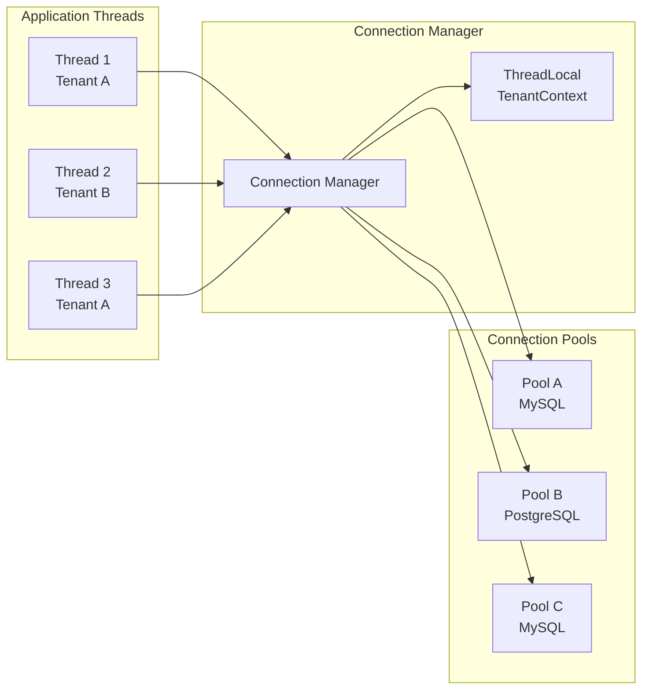
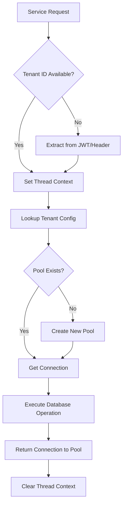
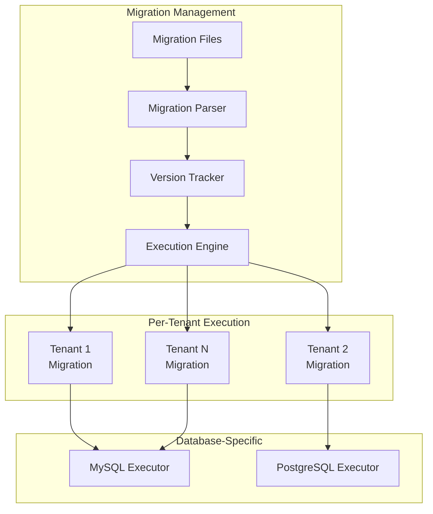

## Executive Summary

This document outlines a comprehensive Database SDK design for a multi-tenant SaaS platform that supports dynamic database creation, runtime datasource switching, and multi-database backends through an SPI (Service Provider Interface) mechanism.

**Key Features:**
- Dynamic database and table creation per tenant
- Runtime datasource switching
- MySQL and PostgreSQL support via SPI
- Connection pooling and performance optimization
- Schema migration management
- Security and isolation guarantees

---

## Architecture Overview

### High-Level Architecture


    subgraph "Application Layer"
        A[SaaS Services] --> B[Database SDK]
    end
    
    subgraph "SDK Core"
        B --> C[Connection Manager]
        B --> D[Schema Manager]
        B --> E[Query Builder]
        B --> F[Migration Engine]
    end
    
    subgraph "SPI Layer"
        C --> G[MySQL Provider]
        C --> H[PostgreSQL Provider]
        D --> G
        D --> H
    end
    
    subgraph "Database Layer"
        G --> I[(MySQL Clusters)]
        H --> J[(PostgreSQL Clusters)]
    end
    
    subgraph "Configuration"
        K[Tenant Registry] --> C
        L[Connection Pools] --> C
    end


### Core Components

The SDK architecture follows a layered approach with clear separation of concerns:

1. **API Layer**: Provides high-level abstractions for database operations
2. **Core Engine**: Handles connection management, schema operations, and query execution
3. **SPI Layer**: Enables pluggable database providers
4. **Provider Implementations**: Database-specific implementations for MySQL and PostgreSQL

**Interview Insight**: *When discussing architecture, emphasize the importance of abstraction layers. This design allows adding new database types without changing client code, demonstrating understanding of the Open/Closed Principle.*

---

## Database SDK Core Design

### Main SDK Interface

```java
public interface DatabaseSDK {
    // Tenant management
    TenantContext createTenant(String tenantId, DatabaseConfig config);
    boolean switchToTenant(String tenantId);
    TenantContext getCurrentTenant();
    
    // Schema operations
    void createDatabase(String databaseName);
    void createTable(String tableName, TableSchema schema);
    void dropTable(String tableName);
    
    // Query operations
    QueryBuilder query();
    <T> List<T> executeQuery(String sql, Class<T> resultType, Object... params);
    int executeUpdate(String sql, Object... params);
    
    // Transaction management
    void beginTransaction();
    void commit();
    void rollback();
    
    // Migration support
    void runMigrations(String migrationsPath);
    MigrationStatus getMigrationStatus();
}
```

### Tenant Context Management


    participant Client
    participant SDK
    participant TenantManager
    participant ConnectionPool
    participant Database
    
    Client->>SDK: createTenant("tenant-123", config)
    SDK->>TenantManager: registerTenant(tenantId, config)
    TenantManager->>Database: CREATE DATABASE tenant_123_db
    TenantManager->>ConnectionPool: createPool(tenantId, config)
    SDK->>Client: TenantContext
    
    Client->>SDK: switchToTenant("tenant-123")
    SDK->>TenantManager: setCurrentTenant(tenantId)
    TenantManager->>ConnectionPool: getConnection(tenantId)
    SDK->>Client: success


**Interview Insight**: *Discuss the importance of thread-local storage for tenant context. This prevents cross-tenant data leakage in multi-threaded environments.*

---

## SPI (Service Provider Interface) Implementation

### Provider Architecture

```java
// Core SPI interface
public interface DatabaseProvider {
    String getProviderName();
    String[] getSupportedVersions();
    
    Connection createConnection(DatabaseConfig config);
    SchemaManager getSchemaManager();
    QueryExecutor getQueryExecutor();
    MigrationEngine getMigrationEngine();
    
    boolean supportsFeature(DatabaseFeature feature);
}

// Provider registration
public class ProviderRegistry {
    private static final Map<String, DatabaseProvider> providers = new ConcurrentHashMap<>();
    
    public static void registerProvider(DatabaseProvider provider) {
        providers.put(provider.getProviderName().toLowerCase(), provider);
    }
    
    public static DatabaseProvider getProvider(String name) {
        return providers.get(name.toLowerCase());
    }
}
```

### MySQL Provider Implementation

```java
@Provider("mysql")
public class MySQLProvider implements DatabaseProvider {
    
    @Override
    public Connection createConnection(DatabaseConfig config) {
        HikariConfig hikariConfig = new HikariConfig();
        hikariConfig.setJdbcUrl(buildJdbcUrl(config));
        hikariConfig.setUsername(config.getUsername());
        hikariConfig.setPassword(config.getPassword());
        
        // MySQL-specific optimizations
        hikariConfig.addDataSourceProperty("cachePrepStmts", "true");
        hikariConfig.addDataSourceProperty("prepStmtCacheSize", "250");
        hikariConfig.addDataSourceProperty("prepStmtCacheSqlLimit", "2048");
        
        return new HikariDataSource(hikariConfig).getConnection();
    }
    
    @Override
    public SchemaManager getSchemaManager() {
        return new MySQLSchemaManager();
    }
    
    private class MySQLSchemaManager implements SchemaManager {
        @Override
        public void createDatabase(String name) {
            executeUpdate("CREATE DATABASE IF NOT EXISTS `" + name + "` " +
                         "CHARACTER SET utf8mb4 COLLATE utf8mb4_unicode_ci");
        }
        
        @Override
        public void createTable(String name, TableSchema schema) {
            StringBuilder sql = new StringBuilder("CREATE TABLE IF NOT EXISTS `")
                .append(name).append("` (");
            
            // Build column definitions with MySQL-specific types
            schema.getColumns().forEach(col -> {
                sql.append("`").append(col.getName()).append("` ");
                sql.append(mapToMySQLType(col.getType()));
                if (col.isPrimaryKey()) sql.append(" PRIMARY KEY");
                if (col.isAutoIncrement()) sql.append(" AUTO_INCREMENT");
                sql.append(", ");
            });
            
            sql.setLength(sql.length() - 2); // Remove last comma
            sql.append(") ENGINE=InnoDB DEFAULT CHARSET=utf8mb4");
            
            executeUpdate(sql.toString());
        }
    }
}
```

### PostgreSQL Provider Implementation

```java
@Provider("postgresql")
public class PostgreSQLProvider implements DatabaseProvider {
    
    @Override
    public SchemaManager getSchemaManager() {
        return new PostgreSQLSchemaManager();
    }
    
    private class PostgreSQLSchemaManager implements SchemaManager {
        @Override
        public void createDatabase(String name) {
            executeUpdate("CREATE DATABASE \"" + name + "\" " +
                         "WITH ENCODING='UTF8' LC_COLLATE='en_US.UTF-8' LC_CTYPE='en_US.UTF-8'");
        }
        
        @Override
        public void createTable(String name, TableSchema schema) {
            StringBuilder sql = new StringBuilder("CREATE TABLE IF NOT EXISTS \"")
                .append(name).append("\" (");
            
            schema.getColumns().forEach(col -> {
                sql.append("\"").append(col.getName()).append("\" ");
                sql.append(mapToPostgreSQLType(col.getType()));
                if (col.isPrimaryKey()) sql.append(" PRIMARY KEY");
                if (col.isAutoIncrement()) sql.append(" GENERATED ALWAYS AS IDENTITY");
                sql.append(", ");
            });
            
            sql.setLength(sql.length() - 2);
            sql.append(")");
            
            executeUpdate(sql.toString());
        }
    }
}
```

**Interview Insight**: *Explain how SPI promotes loose coupling and enables runtime provider discovery. This is crucial for enterprise applications that need to support multiple database vendors.*

---

## Connection Management & Pooling

### Multi-Tenant Connection Architecture



### Connection Pool Implementation

```java
public class TenantConnectionManager {
    private final Map<String, HikariDataSource> tenantPools = new ConcurrentHashMap<>();
    private final ThreadLocal<String> currentTenant = new ThreadLocal<>();
    
    public void createTenantPool(String tenantId, DatabaseConfig config) {
        if (tenantPools.containsKey(tenantId)) {
            throw new IllegalStateException("Tenant pool already exists: " + tenantId);
        }
        
        HikariConfig hikariConfig = new HikariConfig();
        hikariConfig.setJdbcUrl(config.getJdbcUrl());
        hikariConfig.setUsername(config.getUsername());
        hikariConfig.setPassword(config.getPassword());
        
        // Pool sizing based on tenant tier
        TenantTier tier = config.getTier();
        hikariConfig.setMaximumPoolSize(tier.getMaxConnections());
        hikariConfig.setMinimumIdle(tier.getMinConnections());
        hikariConfig.setConnectionTimeout(tier.getConnectionTimeoutMs());
        
        // Monitoring and health checks
        hikariConfig.setRegisterMbeans(true);
        hikariConfig.setHealthCheckRegistry(HealthCheckRegistry.getInstance());
        
        tenantPools.put(tenantId, new HikariDataSource(hikariConfig));
    }
    
    public Connection getConnection() {
        String tenantId = currentTenant.get();
        if (tenantId == null) {
            throw new IllegalStateException("No tenant context set for current thread");
        }
        
        HikariDataSource pool = tenantPools.get(tenantId);
        if (pool == null) {
            throw new IllegalStateException("No connection pool for tenant: " + tenantId);
        }
        
        try {
            return pool.getConnection();
        } catch (SQLException e) {
            throw new DatabaseException("Failed to get connection for tenant: " + tenantId, e);
        }
    }
    
    public void switchTenant(String tenantId) {
        if (!tenantPools.containsKey(tenantId)) {
            throw new IllegalArgumentException("Unknown tenant: " + tenantId);
        }
        currentTenant.set(tenantId);
    }
}
```

**Interview Insight**: *Discuss connection pool tuning strategies. Different tenant tiers might need different pool configurations based on their usage patterns and SLA requirements.*

---

## Runtime Datasource Switching

### Switching Mechanism Flow



### Implementation Example

```java
@Component
public class DatabaseSDKImpl implements DatabaseSDK {
    
    @Autowired
    private TenantConnectionManager connectionManager;
    
    @Autowired
    private TenantRegistry tenantRegistry;
    
    @Override
    public boolean switchToTenant(String tenantId) {
        try {
            TenantConfig config = tenantRegistry.getTenantConfig(tenantId);
            if (config == null) {
                return false;
            }
            
            // Ensure connection pool exists
            if (!connectionManager.hasPool(tenantId)) {
                connectionManager.createTenantPool(tenantId, config.getDatabaseConfig());
            }
            
            // Switch context
            connectionManager.switchTenant(tenantId);
            
            // Verify connection
            try (Connection conn = connectionManager.getConnection()) {
                return conn.isValid(5); // 5 second timeout
            }
            
        } catch (Exception e) {
            log.error("Failed to switch to tenant: " + tenantId, e);
            return false;
        }
    }
    
    @Override
    public void createDatabase(String databaseName) {
        String tenantId = getCurrentTenantId();
        TenantConfig config = tenantRegistry.getTenantConfig(tenantId);
        
        DatabaseProvider provider = ProviderRegistry.getProvider(config.getDatabaseType());
        SchemaManager schemaManager = provider.getSchemaManager();
        
        schemaManager.createDatabase(databaseName);
        
        // Update tenant configuration
        config.addDatabase(databaseName);
        tenantRegistry.updateTenantConfig(tenantId, config);
    }
}
```

**Interview Insight**: *Emphasize the importance of connection validation and proper error handling during tenant switching. Discuss how to handle scenarios where a tenant's database becomes unavailable.*

---

## Schema Management & Migrations

### Migration System Architecture



### Migration Implementation

```java
public class MigrationEngine {
    
    public void runMigrations(String tenantId, String migrationsPath) {
        List<Migration> pendingMigrations = findPendingMigrations(tenantId, migrationsPath);
        
        for (Migration migration : pendingMigrations) {
            try {
                beginTransaction();
                
                // Execute migration for current provider
                DatabaseProvider provider = getCurrentProvider();
                MigrationExecutor executor = provider.getMigrationExecutor();
                
                executor.execute(migration);
                
                // Record migration completion
                recordMigrationCompletion(tenantId, migration);
                
                commit();
                
            } catch (Exception e) {
                rollback();
                throw new MigrationException("Failed to execute migration: " + 
                    migration.getVersion(), e);
            }
        }
    }
    
    private List<Migration> findPendingMigrations(String tenantId, String path) {
        Set<String> appliedVersions = getAppliedMigrations(tenantId);
        
        return loadMigrationsFromPath(path)
            .stream()
            .filter(m -> !appliedVersions.contains(m.getVersion()))
            .sorted(Comparator.comparing(Migration::getVersion))
            .collect(Collectors.toList());
    }
}

// Database-specific migration example
public class MySQLMigrationExecutor implements MigrationExecutor {
    
    @Override
    public void execute(Migration migration) {
        String sql = migration.getSql();
        
        // Handle MySQL-specific syntax transformations
        sql = transformForMySQL(sql);
        
        try (Connection conn = getConnection();
             Statement stmt = conn.createStatement()) {
            
            // Execute migration SQL
            stmt.execute(sql);
            
        } catch (SQLException e) {
            throw new MigrationException("MySQL migration failed", e);
        }
    }
    
    private String transformForMySQL(String sql) {
        // Transform generic SQL to MySQL-specific syntax
        return sql.replaceAll("SERIAL", "INT AUTO_INCREMENT")
                 .replaceAll("BOOLEAN", "TINYINT(1)")
                 .replaceAll("NOW\\(\\)", "CURRENT_TIMESTAMP");
    }
}
```

**Interview Insight**: *Discuss migration rollback strategies and how to handle schema changes that affect multiple tenants. Consider blue-green deployment scenarios.*

---

## Performance Optimization

### Query Optimization Strategies

```java
public class QueryOptimizer {
    
    private final QueryCache queryCache = new QueryCache();
    private final StatementCache preparedStatements = new StatementCache();
    
    public <T> List<T> executeOptimizedQuery(String sql, Class<T> resultType, Object... params) {
        // 1. Check query cache first
        String cacheKey = generateCacheKey(sql, params);
        List<T> cached = queryCache.get(cacheKey);
        if (cached != null) {
            return cached;
        }
        
        // 2. Use prepared statement cache
        PreparedStatement stmt = preparedStatements.get(sql);
        if (stmt == null) {
            stmt = getConnection().prepareStatement(sql);
            preparedStatements.put(sql, stmt);
        }
        
        // 3. Execute with parameters
        setParameters(stmt, params);
        List<T> results = executeAndMap(stmt, resultType);
        
        // 4. Cache results if appropriate
        if (isCacheable(sql)) {
            queryCache.put(cacheKey, results, getCacheTTL(sql));
        }
        
        return results;
    }
}
```

### Connection Pool Monitoring

```java
@Component
public class PoolMonitor {
    
    @Scheduled(fixedRate = 30000) // Every 30 seconds
    public void monitorPools() {
        tenantPools.forEach((tenantId, pool) -> {
            HikariPoolMXBean mxBean = pool.getHikariPoolMXBean();
            
            PoolMetrics metrics = PoolMetrics.builder()
                .tenantId(tenantId)
                .activeConnections(mxBean.getActiveConnections())
                .idleConnections(mxBean.getIdleConnections())
                .totalConnections(mxBean.getTotalConnections())
                .threadsAwaitingConnection(mxBean.getThreadsAwaitingConnection())
                .build();
            
            // Check for potential issues
            if (metrics.getThreadsAwaitingConnection() > 0) {
                alertingService.sendAlert(
                    "Connection pool exhaustion detected for tenant: " + tenantId);
            }
            
            if (metrics.getActiveConnections() > (metrics.getTotalConnections() * 0.8)) {
                log.warn("High connection usage for tenant {}: {}%", 
                    tenantId, (metrics.getActiveConnections() * 100 / metrics.getTotalConnections()));
            }
            
            metricsCollector.record(metrics);
        });
    }
}
```

**Interview Insight**: *Discuss how to balance between connection pool efficiency and memory usage. Explain the trade-offs between having many small pools vs. fewer large pools.*

---

## Security & Isolation

### Tenant Isolation Strategies


    subgraph "Isolation Levels"
        A[Database Level<br/>Separate DB per tenant]
        B[Schema Level<br/>Separate schema per tenant]
        C[Row Level<br/>Tenant ID in each row]
    end
    
    subgraph "Security Measures"
        D[Connection Encryption]
        E[Access Control Lists]
        F[Query Validation]
        G[Audit Logging]
    end
    
    A --> D
    B --> E
    C --> F
    A --> G
    B --> G
    C --> G


### Security Implementation

```java
public class SecurityManager {
    
    public void validateTenantAccess(String tenantId, String userId) {
        TenantAccessControl acl = getTenantACL(tenantId);
        
        if (!acl.hasAccess(userId)) {
            auditLogger.logUnauthorizedAccess(tenantId, userId);
            throw new UnauthorizedAccessException("User " + userId + 
                " does not have access to tenant " + tenantId);
        }
    }
    
    public String sanitizeQuery(String sql) {
        // Prevent SQL injection
        if (containsDangerousPatterns(sql)) {
            throw new SecurityException("Potentially dangerous SQL detected");
        }
        
        // Ensure tenant context is properly applied
        if (!containsTenantFilter(sql)) {
            sql = addTenantFilter(sql);
        }
        
        return sql;
    }
    
    private boolean containsDangerousPatterns(String sql) {
        String[] dangerousPatterns = {
            "DROP\\s+TABLE", "DELETE\\s+FROM.*WHERE\\s+1=1", 
            "UNION\\s+SELECT", "INTO\\s+OUTFILE"
        };
        
        return Arrays.stream(dangerousPatterns)
            .anyMatch(pattern -> sql.toUpperCase().matches(".*" + pattern + ".*"));
    }
}
```

**Interview Insight**: *Discuss the CAP theorem implications for multi-tenant databases and how to choose between consistency, availability, and partition tolerance based on business requirements.*

---

## Monitoring & Observability

### Metrics Collection

```java
@Component
public class DatabaseMetricsCollector {
    
    private final MeterRegistry meterRegistry;
    private final Map<String, Timer> queryTimers = new ConcurrentHashMap<>();
    
    public void recordQueryExecution(String tenantId, String queryType, Duration duration) {
        Timer timer = Timer.builder("database.query.duration")
            .tag("tenant", tenantId)
            .tag("query_type", queryType)
            .register(meterRegistry);
        
        timer.record(duration);
    }
    
    public void recordConnectionPoolMetrics(String tenantId, PoolMetrics metrics) {
        Gauge.builder("database.pool.active_connections")
            .tag("tenant", tenantId)
            .register(meterRegistry, metrics, PoolMetrics::getActiveConnections);
            
        Gauge.builder("database.pool.idle_connections")
            .tag("tenant", tenantId)
            .register(meterRegistry, metrics, PoolMetrics::getIdleConnections);
    }
}
```

### Health Checks

```java
@Component
public class DatabaseHealthIndicator implements HealthIndicator {
    
    @Override
    public Health health() {
        Health.Builder builder = new Health.Builder();
        
        Map<String, Object> details = new HashMap<>();
        boolean allHealthy = true;
        
        for (String tenantId : tenantRegistry.getAllTenantIds()) {
            try {
                boolean healthy = checkTenantHealth(tenantId);
                details.put("tenant_" + tenantId, healthy ? "UP" : "DOWN");
                allHealthy = allHealthy && healthy;
            } catch (Exception e) {
                details.put("tenant_" + tenantId, "ERROR: " + e.getMessage());
                allHealthy = false;
            }
        }
        
        details.put("total_tenants", tenantRegistry.getTenantCount());
        details.put("healthy_tenants", details.values().stream()
            .mapToInt(v -> "UP".equals(v) ? 1 : 0).sum());
        
        return allHealthy ? builder.up().withDetails(details).build() 
                         : builder.down().withDetails(details).build();
    }
    
    private boolean checkTenantHealth(String tenantId) {
        try (Connection conn = connectionManager.getConnection(tenantId)) {
            return conn.isValid(5);
        } catch (Exception e) {
            return false;
        }
    }
}
```

**Interview Insight**: *Explain how to implement circuit breakers for database connections and discuss strategies for graceful degradation when database issues occur.*

---

## Best Practices & Patterns

### Configuration Management

```yaml
# application.yml
database-sdk:
  default-provider: mysql
  connection-pools:
    default:
      maximum-pool-size: 10
      minimum-idle: 2
      connection-timeout: 30000
      idle-timeout: 600000
      max-lifetime: 1800000
    
  tenant-tiers:
    basic:
      max-connections: 5
      connection-timeout: 10000
    premium:
      max-connections: 20
      connection-timeout: 30000
    enterprise:
      max-connections: 50
      connection-timeout: 60000
  
  providers:
    mysql:
      driver-class: com.mysql.cj.jdbc.Driver
      validation-query: "SELECT 1"
      properties:
        cachePrepStmts: true
        prepStmtCacheSize: 250
    
    postgresql:
      driver-class: org.postgresql.Driver
      validation-query: "SELECT 1"
      properties:
        prepareThreshold: 1
        preparedStatementCacheQueries: 256
```

### Error Handling Strategy

```java
public class DatabaseExceptionHandler {
    
    public void handleException(Exception e, String operation, String tenantId) {
        if (e instanceof SQLException) {
            SQLException sqlEx = (SQLException) e;
            
            switch (sqlEx.getErrorCode()) {
                case 1062: // MySQL duplicate key
                case 23505: // PostgreSQL unique violation
                    throw new DuplicateKeyException("Duplicate key violation", sqlEx);
                    
                case 1205: // MySQL lock timeout
                case 55P03: // PostgreSQL lock timeout  
                    throw new LockTimeoutException("Database lock timeout", sqlEx);
                    
                case 2006: // MySQL server gone away
                case 57P01: // PostgreSQL connection failure
                    handleConnectionFailure(tenantId, sqlEx);
                    break;
                    
                default:
                    log.error("Unhandled SQL exception for tenant {}: {}", 
                        tenantId, sqlEx.getMessage(), sqlEx);
                    throw new DatabaseException("Database operation failed", sqlEx);
            }
        }
        
        // Handle other exception types
        if (e instanceof ConnectionPoolException) {
            handlePoolExhaustion(tenantId, e);
        }
    }
    
    private void handleConnectionFailure(String tenantId, SQLException e) {
        // Mark connection pool as unhealthy
        connectionManager.markPoolUnhealthy(tenantId);
        
        // Trigger reconnection attempt
        scheduledExecutor.schedule(() -> {
            try {
                connectionManager.validateAndRepairPool(tenantId);
            } catch (Exception ex) {
                log.error("Failed to repair connection pool for tenant: " + tenantId, ex);
            }
        }, 30, TimeUnit.SECONDS);
        
        throw new DatabaseConnectionException("Database connection failed", e);
    }
}
```

**Interview Insight**: *Discuss the importance of proper exception handling in database layers and how it affects the overall system reliability. Mention strategies for handling transient vs. permanent failures.*

---

## Testing Strategy

### Unit Testing

```java
@ExtendWith(MockitoExtension.class)
class DatabaseSDKTest {
    
    @Mock
    private TenantConnectionManager connectionManager;
    
    @Mock
    private TenantRegistry tenantRegistry;
    
    @InjectMocks
    private DatabaseSDKImpl databaseSDK;
    
    @Test
    void shouldCreateTenantSuccessfully() {
        // Given
        String tenantId = "test-tenant";
        DatabaseConfig config = DatabaseConfig.builder()
            .provider("mysql")
            .host("localhost")
            .port(3306)
            .build();
        
        when(tenantRegistry.getTenantConfig(tenantId)).thenReturn(null);
        
        // When
        TenantContext context = databaseSDK.createTenant(tenantId, config);
        
        // Then
        assertThat(context.getTenantId()).isEqualTo(tenantId);
        verify(connectionManager).createTenantPool(eq(tenantId), any(DatabaseConfig.class));
        verify(tenantRegistry).registerTenant(eq(tenantId), any(TenantConfig.class));
    }
    
    @Test
    void shouldSwitchTenantSuccessfully() {
        // Given
        String tenantId = "existing-tenant";
        TenantConfig config = new TenantConfig(tenantId, mock(DatabaseConfig.class));
        
        when(tenantRegistry.getTenantConfig(tenantId)).thenReturn(config);
        when(connectionManager.hasPool(tenantId)).thenReturn(true);
        when(connectionManager.getConnection()).thenReturn(mock(Connection.class));
        
        // When
        boolean result = databaseSDK.switchToTenant(tenantId);
        
        // Then
        assertThat(result).isTrue();
        verify(connectionManager).switchTenant(tenantId);
    }
}
```

### Integration Testing

```java
@TestContainers
@SpringBootTest
class DatabaseSDKIntegrationTest {
    
    @Container
    static MySQLContainer<?> mysql = new MySQLContainer<>("mysql:8.0")
            .withDatabaseName("test_db")
            .withUsername("test")
            .withPassword("test");
    
    @Container
    static PostgreSQLContainer<?> postgres = new PostgreSQLContainer<>("postgres:13")
            .withDatabaseName("test_db")
            .withUsername("test")
            .withPassword("test");
    
    @Autowired
    private DatabaseSDK databaseSDK;
    
    @Test
    void shouldWorkWithMySQLProvider() {
        // Given
        DatabaseConfig config = DatabaseConfig.builder()
            .provider("mysql")
            .jdbcUrl(mysql.getJdbcUrl())
            .username(mysql.getUsername())
            .password(mysql.getPassword())
            .build();
        
        // When
        TenantContext context = databaseSDK.createTenant("mysql-tenant", config);
        databaseSDK.switchToTenant("mysql-tenant");
        
        // Then
        databaseSDK.createTable("users", UserTableSchema.create());
        
        List<String> tables = databaseSDK.query()
            .select("table_name")
            .from("information_schema.tables")
            .where("table_schema = ?", "test_db")
            .executeList(String.class);
        
        assertThat(tables).contains("users");
    }
}
```

**Interview Insight**: *Emphasize the importance of testing with real databases using testcontainers. Discuss how to create comprehensive test suites that cover both happy path and failure scenarios, including network partitions and database failovers.*

---

## Deployment & Operations

### Deployment Architecture


    subgraph "Load Balancer"
        LB[Application Load Balancer]
    end
    
    subgraph "Application Tier"
        A1[App Instance 1<br/>Database SDK]
        A2[App Instance 2<br/>Database SDK]
        A3[App Instance N<br/>Database SDK]
    end
    
    subgraph "Database Tier"
        subgraph "MySQL Cluster"
            M1[(MySQL Master)]
            M2[(MySQL Replica 1)]
            M3[(MySQL Replica 2)]
        end
        
        subgraph "PostgreSQL Cluster"
            P1[(PostgreSQL Master)]
            P2[(PostgreSQL Replica 1)]
            P3[(PostgreSQL Replica 2)]
        end
    end
    
    subgraph "Configuration"
        C1[Config Server]
        C2[Service Discovery]
        C3[Tenant Registry]
    end
    
    LB --> A1
    LB --> A2
    LB --> A3
    
    A1 --> M1
    A1 --> P1
    A2 --> M1
    A2 --> P1
    A3 --> M1
    A3 --> P1
    
    M1 --> M2
    M1 --> M3
    P1 --> P2
    P1 --> P3
    
    A1 --> C1
    A2 --> C2
    A3 --> C3


### Configuration Management

```java
@Configuration
@EnableConfigurationProperties(DatabaseSDKProperties.class)
public class DatabaseSDKAutoConfiguration {
    
    @Bean
    @ConditionalOnMissingBean
    public DatabaseSDK databaseSDK(DatabaseSDKProperties properties) {
        return DatabaseSDKBuilder.builder()
            .withProperties(properties)
            .withProviders(discoverProviders())
            .withMetrics(meterRegistry())
            .build();
    }
    
    @Bean
    public TenantConnectionManager tenantConnectionManager(
            DatabaseSDKProperties properties) {
        return new TenantConnectionManager(properties.getConnectionPools());
    }
    
    @Bean
    public DatabaseHealthIndicator databaseHealthIndicator(
            DatabaseSDK databaseSDK) {
        return new DatabaseHealthIndicator(databaseSDK);
    }
    
    private List<DatabaseProvider> discoverProviders() {
        return ServiceLoader.load(DatabaseProvider.class)
            .stream()
            .map(ServiceLoader.Provider::get)
            .collect(Collectors.toList());
    }
}
```

### Graceful Shutdown

```java
@Component
public class DatabaseSDKShutdownHandler {
    
    @Autowired
    private TenantConnectionManager connectionManager;
    
    @PreDestroy
    public void shutdown() {
        log.info("Initiating graceful database SDK shutdown...");
        
        try {
            // 1. Stop accepting new connections
            connectionManager.stopAcceptingNewConnections();
            
            // 2. Wait for active transactions to complete
            waitForActiveTransactions(Duration.ofSeconds(30));
            
            // 3. Close all connection pools
            connectionManager.closeAllPools();
            
            log.info("Database SDK shutdown completed successfully");
            
        } catch (Exception e) {
            log.error("Error during database SDK shutdown", e);
        }
    }
    
    private void waitForActiveTransactions(Duration timeout) {
        long endTime = System.currentTimeMillis() + timeout.toMillis();
        
        while (System.currentTimeMillis() < endTime) {
            if (connectionManager.getActiveTransactionCount() == 0) {
                break;
            }
            
            try {
                Thread.sleep(100);
            } catch (InterruptedException e) {
                Thread.currentThread().interrupt();
                break;
            }
        }
    }
}
```

**Interview Insight**: *Discuss the importance of graceful shutdown in distributed systems. Explain how improper shutdown can lead to data corruption or transaction rollbacks.*

---

## Scalability Considerations

### Horizontal Scaling Strategy


    A[Incoming Request] --> B{Load Balancer}
    B --> C[App Instance 1]
    B --> D[App Instance 2]
    B --> E[App Instance N]
    
    C --> F{Tenant Router}
    D --> F
    E --> F
    
    F --> G[Tenant Shard 1<br/>MySQL]
    F --> H[Tenant Shard 2<br/>PostgreSQL]
    F --> I[Tenant Shard N<br/>Mixed]
    
    J[Tenant Registry] --> F
    K[Shard Manager] --> F


### Sharding Implementation

```java
public class TenantShardManager {
    
    private final Map<String, ShardConfiguration> shardConfigurations;
    private final ConsistentHashRing<String> hashRing;
    
    public TenantShardManager(List<ShardConfiguration> shards) {
        this.shardConfigurations = shards.stream()
            .collect(Collectors.toMap(ShardConfiguration::getShardId, Function.identity()));
        
        this.hashRing = new ConsistentHashRing<>(
            shards.stream().map(ShardConfiguration::getShardId).collect(Collectors.toList()),
            160 // virtual nodes per shard
        );
    }
    
    public String getShardForTenant(String tenantId) {
        return hashRing.get(tenantId);
    }
    
    public void addShard(ShardConfiguration shard) {
        shardConfigurations.put(shard.getShardId(), shard);
        hashRing.add(shard.getShardId());
        
        // Trigger rebalancing if needed
        scheduleRebalancing();
    }
    
    public void removeShard(String shardId) {
        ShardConfiguration shard = shardConfigurations.remove(shardId);
        if (shard != null) {
            hashRing.remove(shardId);
            
            // Migrate tenants to other shards
            migrateTenants(shardId);
        }
    }
    
    private void migrateTenants(String fromShard) {
        List<String> tenantsToMigrate = getTenantsByShardId(fromShard);
        
        for (String tenantId : tenantsToMigrate) {
            String newShard = getShardForTenant(tenantId);
            migrateTenant(tenantId, fromShard, newShard);
        }
    }
}
```

### Read Replica Support

```java
public class ReadWriteSplitConnectionManager extends TenantConnectionManager {
    
    private final Map<String, List<HikariDataSource>> readReplicas = new ConcurrentHashMap<>();
    private final LoadBalancer<HikariDataSource> replicaLoadBalancer;
    
    @Override
    public Connection getConnection(AccessType accessType) {
        String tenantId = getCurrentTenantId();
        
        if (accessType == AccessType.READ_ONLY) {
            return getReadOnlyConnection(tenantId);
        } else {
            return getWriteConnection(tenantId);
        }
    }
    
    private Connection getReadOnlyConnection(String tenantId) {
        List<HikariDataSource> replicas = readReplicas.get(tenantId);
        
        if (replicas == null || replicas.isEmpty()) {
            // Fallback to master if no replicas available
            return getWriteConnection(tenantId);
        }
        
        HikariDataSource selectedReplica = replicaLoadBalancer.select(replicas);
        
        try {
            Connection conn = selectedReplica.getConnection();
            conn.setReadOnly(true);
            return conn;
        } catch (SQLException e) {
            // If replica fails, fallback to master
            log.warn("Failed to get read replica connection for tenant: " + tenantId, e);
            return getWriteConnection(tenantId);
        }
    }
    
    public void addReadReplica(String tenantId, DatabaseConfig replicaConfig) {
        HikariDataSource replicaPool = createDataSource(replicaConfig);
        
        readReplicas.computeIfAbsent(tenantId, k -> new ArrayList<>()).add(replicaPool);
        
        // Health check for the new replica
        scheduleHealthCheck(tenantId, replicaPool);
    }
}
```

**Interview Insight**: *Explain the CAP theorem implications when designing read replicas. Discuss eventual consistency vs. strong consistency trade-offs and when to use each approach.*

---

## Advanced Features

### Query Result Caching

```java
public class QueryCacheManager {
    
    private final Cache<String, CachedResult> cache;
    private final QueryAnalyzer queryAnalyzer;
    
    public QueryCacheManager(CacheConfiguration config) {
        this.cache = Caffeine.newBuilder()
            .maximumSize(config.getMaxSize())
            .expireAfterWrite(config.getTtl())
            .recordStats()
            .build();
        
        this.queryAnalyzer = new QueryAnalyzer();
    }
    
    public <T> List<T> executeWithCache(String sql, Class<T> resultType, Object... params) {
        if (!queryAnalyzer.isCacheable(sql)) {
            return executeDirectly(sql, resultType, params);
        }
        
        String cacheKey = generateCacheKey(sql, params);
        CachedResult cached = cache.getIfPresent(cacheKey);
        
        if (cached != null && !cached.isExpired()) {
            cacheHitCounter.increment();
            return (List<T>) cached.getResults();
        }
        
        List<T> results = executeDirectly(sql, resultType, params);
        
        // Cache the results
        cache.put(cacheKey, new CachedResult(results, System.currentTimeMillis()));
        cacheMissCounter.increment();
        
        return results;
    }
    
    public void invalidateCache(String pattern) {
        // Invalidate cache entries matching the pattern
        cache.asMap().keySet().stream()
            .filter(key -> key.matches(pattern))
            .forEach(cache::invalidate);
    }
    
    // Smart cache invalidation based on table changes
    @EventListener
    public void handleTableModification(TableModificationEvent event) {
        String tableName = event.getTableName();
        String tenantId = event.getTenantId();
        
        // Invalidate all cache entries for this table and tenant
        String pattern = String.format(".*%s.*%s.*", tenantId, tableName);
        invalidateCache(pattern);
    }
}
```

### Database Connection Failover

```java
public class FailoverConnectionManager {
    
    private final Map<String, DatabaseCluster> clusters = new ConcurrentHashMap<>();
    private final CircuitBreakerRegistry circuitBreakerRegistry;
    
    public Connection getConnection(String tenantId) {
        DatabaseCluster cluster = clusters.get(tenantId);
        if (cluster == null) {
            throw new IllegalStateException("No cluster found for tenant: " + tenantId);
        }
        
        // Try primary first
        CircuitBreaker primaryCircuitBreaker = circuitBreakerRegistry
            .circuitBreaker("primary-" + tenantId);
        
        return primaryCircuitBreaker.executeSupplier(() -> {
            try {
                return cluster.getPrimaryDataSource().getConnection();
            } catch (SQLException e) {
                throw new DatabaseConnectionException("Primary connection failed", e);
            }
        }).recover(throwable -> {
            // Failover to secondary
            log.warn("Primary database failed for tenant {}, failing over to secondary", 
                tenantId, throwable);
            
            return getSecondaryConnection(cluster);
        });
    }
    
    private Connection getSecondaryConnection(DatabaseCluster cluster) {
        List<HikariDataSource> secondaries = cluster.getSecondaryDataSources();
        
        for (HikariDataSource secondary : secondaries) {
            try {
                Connection conn = secondary.getConnection();
                if (conn.isValid(5)) {
                    return conn;
                }
            } catch (SQLException e) {
                log.warn("Secondary database connection failed", e);
            }
        }
        
        throw new DatabaseConnectionException("All database connections failed");
    }
    
    @Scheduled(fixedRate = 30000)
    public void healthCheck() {
        clusters.forEach((tenantId, cluster) -> {
            checkClusterHealth(tenantId, cluster);
        });
    }
    
    private void checkClusterHealth(String tenantId, DatabaseCluster cluster) {
        // Check primary health
        boolean primaryHealthy = checkDataSourceHealth(cluster.getPrimaryDataSource());
        
        if (!primaryHealthy) {
            // Try to recover primary
            tryRecoverPrimary(tenantId, cluster);
        }
        
        // Check secondary health
        cluster.getSecondaryDataSources().forEach(secondary -> {
            if (!checkDataSourceHealth(secondary)) {
                log.warn("Secondary database unhealthy for tenant: {}", tenantId);
            }
        });
    }
}
```

### Multi-Region Support

```java
public class MultiRegionDatabaseManager {
    
    private final Map<String, RegionConfig> regions;
    private final TenantRegionMapper tenantRegionMapper;
    
    public void createTenantInRegion(String tenantId, String regionId, DatabaseConfig config) {
        RegionConfig region = regions.get(regionId);
        if (region == null) {
            throw new IllegalArgumentException("Unknown region: " + regionId);
        }
        
        // Create database in the specified region
        DatabaseProvider provider = getProviderForRegion(regionId, config.getProvider());
        
        // Adjust config for region-specific settings
        DatabaseConfig regionConfig = config.toBuilder()
            .host(region.getDatabaseHost())
            .port(region.getDatabasePort())
            .additionalProperties(region.getProviderProperties())
            .build();
        
        // Create tenant database
        createTenantDatabase(tenantId, regionConfig, provider);
        
        // Register tenant-region mapping
        tenantRegionMapper.mapTenantToRegion(tenantId, regionId);
        
        // Setup cross-region replication if required
        if (config.isReplicationEnabled()) {
            setupCrossRegionReplication(tenantId, regionId, config);
        }
    }
    
    public Connection getConnection(String tenantId) {
        String regionId = tenantRegionMapper.getRegionForTenant(tenantId);
        if (regionId == null) {
            throw new IllegalStateException("No region mapping found for tenant: " + tenantId);
        }
        
        return getConnectionForRegion(tenantId, regionId);
    }
    
    private void setupCrossRegionReplication(String tenantId, String primaryRegion, 
                                           DatabaseConfig config) {
        List<String> replicaRegions = config.getReplicaRegions();
        
        for (String replicaRegion : replicaRegions) {
            if (!replicaRegion.equals(primaryRegion)) {
                createReplicaInRegion(tenantId, primaryRegion, replicaRegion);
            }
        }
    }
}
```

**Interview Insight**: *Discuss data sovereignty and compliance requirements when implementing multi-region support. Explain how GDPR, data residency laws, and cross-border data transfer regulations affect database architecture decisions.*

---

## Interview Questions & Answers

### Architecture & Design Questions

**Q: How would you handle database schema evolution across multiple tenants?**

**A:** I would implement a versioned migration system with the following approach:

1. **Migration Versioning**: Each migration has a version number and is applied in order
2. **Tenant-Specific Tracking**: Track migration status per tenant in a dedicated `schema_migrations` table
3. **Rollback Support**: Design migrations to be reversible when possible
4. **Batch Processing**: Apply migrations to tenants in batches to avoid overwhelming the system
5. **Validation**: Validate schema consistency after migrations complete

```java
// Example migration tracking
public class MigrationTracker {
    public void trackMigration(String tenantId, String version, MigrationStatus status) {
        String sql = "INSERT INTO schema_migrations (tenant_id, version, status, applied_at) VALUES (?, ?, ?, ?)";
        executeUpdate(sql, tenantId, version, status.name(), Timestamp.now());
    }
}
```

**Q: How do you prevent connection pool exhaustion in a multi-tenant environment?**

**A:** Several strategies can be employed:

1. **Tier-based Pool Sizing**: Different tenant tiers get different pool sizes
2. **Dynamic Pool Adjustment**: Monitor usage patterns and adjust pool sizes
3. **Connection Timeouts**: Set appropriate timeouts to prevent connection leaks
4. **Circuit Breakers**: Implement circuit breakers to fail fast when pools are exhausted
5. **Monitoring & Alerting**: Set up alerts for high pool utilization

```java
// Example dynamic pool adjustment
@Scheduled(fixedRate = 60000)
public void adjustPoolSizes() {
    tenantPools.forEach((tenantId, pool) -> {
        PoolMetrics metrics = getPoolMetrics(pool);
        if (metrics.getUtilization() > 0.8) {
            scaleUpPool(tenantId, pool);
        } else if (metrics.getUtilization() < 0.2) {
            scaleDownPool(tenantId, pool);
        }
    });
}
```

### Performance & Scalability Questions

**Q: How would you optimize database queries across different database providers?**

**A:** Query optimization requires a multi-layered approach:

1. **Provider-Specific Optimizations**: Each database provider has its own optimizer hints and features
2. **Query Analysis**: Analyze query patterns to identify optimization opportunities
3. **Index Management**: Automatically suggest and create indexes based on query patterns
4. **Query Rewriting**: Transform queries to use database-specific optimizations
5. **Caching Strategy**: Implement intelligent caching at multiple levels

**Q: How do you handle database failover without losing data?**

**A:** Implement a robust failover mechanism:

1. **Synchronous Replication**: Use synchronous replication for critical data
2. **Health Monitoring**: Continuous health checks with rapid failure detection
3. **Automatic Failover**: Implement automatic failover with proper coordination
4. **Connection Draining**: Gracefully drain connections during failover
5. **Consistency Checks**: Verify data consistency after failover

### Security & Compliance Questions

**Q: How do you ensure tenant data isolation in a shared database environment?**

**A:** Multiple isolation strategies can be implemented:

1. **Database-Level Isolation**: Separate databases per tenant (strongest isolation)
2. **Schema-Level Isolation**: Separate schemas within the same database
3. **Row-Level Security**: Use database row-level security features
4. **Application-Level Filtering**: Ensure all queries include tenant filters
5. **Access Control**: Implement strict access controls and audit logging

**Q: How would you implement audit logging for compliance requirements?**

**A:** Comprehensive audit logging includes:

1. **Data Access Logging**: Log all data access with user context
2. **Schema Change Tracking**: Track all DDL operations
3. **Connection Logging**: Log connection events and authentication
4. **Query Logging**: Log sensitive query operations
5. **Tamper-Proof Storage**: Store audit logs in immutable storage

---

## Conclusion

This Database SDK design provides a comprehensive solution for multi-tenant SaaS applications with the following key benefits:

### Key Advantages

1. **Flexibility**: Support for multiple database providers through SPI
2. **Scalability**: Horizontal scaling through sharding and connection pooling
3. **Isolation**: Strong tenant isolation with multiple strategies
4. **Performance**: Optimized connection management and query caching
5. **Observability**: Comprehensive monitoring and health checking
6. **Reliability**: Failover support and graceful degradation

### Implementation Roadmap

**Phase 1: Core Infrastructure**
- Implement basic SDK structure and SPI framework
- Create MySQL and PostgreSQL providers
- Set up connection pooling and tenant management

**Phase 2: Advanced Features**
- Add migration engine and schema management
- Implement query optimization and caching
- Add monitoring and health checks

**Phase 3: Enterprise Features**
- Implement sharding and multi-region support
- Add advanced security features
- Complete performance optimization

**Phase 4: Operations & Maintenance**
- Automated deployment and configuration
- Advanced monitoring and alerting
- Documentation and training

### Success Metrics

- **Performance**: Sub-100ms query response times
- **Scalability**: Support for 10,000+ concurrent tenants
- **Reliability**: 99.9% uptime with automatic failover
- **Security**: Zero data breaches with complete audit trails

This architecture provides a solid foundation for building scalable, secure, and maintainable multi-tenant database solutions that can grow with your SaaS platform's needs.

---

*This document serves as a comprehensive guide for implementing a production-ready Database SDK. Each section can be expanded based on specific requirements and constraints of your particular use case.*