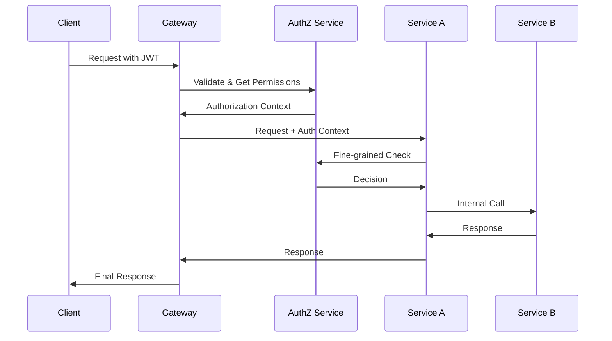

## Introduction

Modern applications require sophisticated access control mechanisms that balance security, flexibility, and performance. This guide explores the design and implementation of privilege systems that combine Role-Based Access Control (RBAC) with Attribute-Based Access Control (ABAC) to create robust, scalable authorization frameworks.

**Key Design Principles:**
- **Principle of Least Privilege**: Grant minimum necessary permissions
- **Separation of Duties**: Distribute critical operations across multiple roles
- **Defense in Depth**: Multiple layers of authorization checks
- **Zero Trust**: Never trust, always verify

### Common Interview Insight
*"How would you handle a scenario where a user needs temporary elevated privileges for a specific project?"* This question tests understanding of dynamic authorization and temporal access controls - areas where pure RBAC falls short and ABAC excels.

---

## RBAC Fundamentals

Role-Based Access Control forms the foundation of most enterprise authorization systems due to its simplicity and alignment with organizational structures.

### Core Components


    U[Users] --> UR[User-Role Assignment]
    UR --> R[Roles]
    R --> RP[Role-Permission Assignment]
    RP --> P[Permissions]
    P --> O[Objects/Resources]
    
    subgraph "RBAC Model"
        U
        R
        P
        O
    end


### RBAC Implementation Patterns

#### Hierarchical RBAC

    CEO[CEO Role] --> VP[VP Role]
    VP --> Director[Director Role]
    VP --> Manager[Manager Role]
    Director --> Manager
    Manager --> Employee[Employee Role]
    Manager --> Contractor[Contractor Role]
    
    style CEO fill:#ff9999
    style VP fill:#ffcc99
    style Director fill:#ffff99
    style Manager fill:#ccff99
    style Employee fill:#99ccff
    style Contractor fill:#cc99ff


#### Role Composition Example
```json
{
  "role": "ProjectManager",
  "inherits": ["Employee"],
  "permissions": [
    "project.create",
    "project.update",
    "project.assign_team_members",
    "reports.generate"
  ],
  "constraints": {
    "department": ["Engineering", "Product"],
    "max_budget": 100000
  }
}
```

### RBAC Strengths and Limitations

**Strengths:**
- Simple to understand and implement
- Aligns with organizational hierarchy
- Efficient permission checking
- Good audit trail

**Limitations:**
- Role explosion problem
- Difficulty handling contextual permissions
- Static nature limits flexibility
- Complex role combinations

### Interview Insight: Role Explosion
*"How do you prevent role explosion in large organizations?"* Key strategies include role hierarchies, role composition, and hybrid approaches with ABAC for contextual decisions.

---

## ABAC Fundamentals

Attribute-Based Access Control provides fine-grained, contextual authorization by evaluating attributes of subjects, objects, actions, and environment.

### ABAC Policy Model


    subgraph "Subject Attributes"
        SA[User ID, Department, Clearance Level, Location]
    end
    
    subgraph "Object Attributes"
        OA[Resource Type, Owner, Classification, Creation Date]
    end
    
    subgraph "Action Attributes"
        AA[Operation Type, Time, Method]
    end
    
    subgraph "Environment Attributes"
        EA[Time, Location, Network, Device]
    end
    
    SA --> PEP[Policy Enforcement Point]
    OA --> PEP
    AA --> PEP
    EA --> PEP
    
    PEP --> PDP[Policy Decision Point]
    PDP --> PAP[Policy Administration Point]
    PDP --> PIP[Policy Information Point]


### ABAC Policy Examples

#### Document Access Policy
```xml
<Policy PolicyId="DocumentAccessPolicy">
  <Rule Effect="Permit">
    <Condition>
      <Apply FunctionId="and">
        <Apply FunctionId="string-equal">
          <AttributeValue DataType="string">Engineering</AttributeValue>
          <SubjectAttributeDesignator AttributeId="department"/>
        </Apply>
        <Apply FunctionId="string-equal">
          <AttributeValue DataType="string">confidential</AttributeValue>
          <ResourceAttributeDesignator AttributeId="classification"/>
        </Apply>
        <Apply FunctionId="time-in-range">
          <EnvironmentAttributeDesignator AttributeId="current-time"/>
          <AttributeValue DataType="time">09:00:00</AttributeValue>
          <AttributeValue DataType="time">17:00:00</AttributeValue>
        </Apply>
      </Apply>
    </Condition>
  </Rule>
</Policy>
```

#### JSON-based Policy (More Readable)
```json
{
  "policy_id": "dynamic_resource_access",
  "version": "1.0",
  "rules": [
    {
      "effect": "PERMIT",
      "condition": {
        "and": [
          {"eq": ["${subject.clearance_level}", "secret"]},
          {"eq": ["${resource.classification}", "secret"]},
          {"in": ["${subject.department}", ["Defense", "Intelligence"]]},
          {"time_range": ["09:00", "17:00"]},
          {"geo_fence": ["${subject.location}", "secure_facility"]}
        ]
      }
    }
  ]
}
```

### Interview Insight: Policy Complexity
*"How do you manage policy complexity in ABAC systems?"* Focus on policy versioning, testing frameworks, policy simulation tools, and gradual migration strategies.

---

## Hybrid RBAC-ABAC Architecture

The most effective modern privilege systems combine RBAC's simplicity with ABAC's flexibility, using each approach where it provides the most value.

### Decision Flow Architecture


    A[Access Request] --> B{RBAC Check}
    B -->|Deny| C[Access Denied]
    B -->|Permit| D{ABAC Required?}
    B -->|Conditional| D
    
    D -->|No| E[Access Granted]
    D -->|Yes| F[ABAC Evaluation]
    
    F --> G{ABAC Result}
    G -->|Permit| E
    G -->|Deny| C
    G -->|NotApplicable| H[Default Policy]
    
    H --> I{Default Action}
    I -->|Allow| E
    I -->|Deny| C


### Layered Authorization Model


    subgraph "Layer 1: RBAC Foundation"
        R1[Basic Role Permissions]
        R2[Department Access]
        R3[Hierarchical Inheritance]
    end
    
    subgraph "Layer 2: ABAC Enhancement"
        A1[Contextual Conditions]
        A2[Dynamic Attributes]
        A3[Environmental Factors]
    end
    
    subgraph "Layer 3: Business Rules"
        B1[Compliance Requirements]
        B2[Workflow States]
        B3[Data Sensitivity]
    end
    
    R1 --> A1
    R2 --> A2
    R3 --> A3
    A1 --> B1
    A2 --> B2
    A3 --> B3


### Implementation Strategy

#### Phase 1: RBAC Foundation
```python
class RBACEngine:
    def __init__(self):
        self.user_roles = {}  # user_id -> [roles]
        self.role_permissions = {}  # role -> [permissions]
        self.role_hierarchy = {}  # parent_role -> [child_roles]
    
    def check_permission(self, user_id: str, permission: str) -> bool:
        user_roles = self.get_effective_roles(user_id)
        for role in user_roles:
            if permission in self.role_permissions.get(role, []):
                return True
        return False
    
    def get_effective_roles(self, user_id: str) -> set:
        direct_roles = set(self.user_roles.get(user_id, []))
        effective_roles = direct_roles.copy()
        
        # Add inherited roles
        for role in direct_roles:
            effective_roles.update(self._get_inherited_roles(role))
        
        return effective_roles
```

#### Phase 2: ABAC Integration
```python
class HybridAuthorizationEngine:
    def __init__(self, rbac_engine: RBACEngine, abac_engine: ABACEngine):
        self.rbac = rbac_engine
        self.abac = abac_engine
    
    def authorize(self, request: AuthRequest) -> AuthResult:
        # Step 1: RBAC evaluation
        rbac_result = self.rbac.evaluate(request)
        
        if rbac_result.decision == Decision.DENY:
            return rbac_result
        
        # Step 2: Check if ABAC evaluation needed
        if self._requires_abac_evaluation(request, rbac_result):
            abac_result = self.abac.evaluate(request)
            return self._combine_results(rbac_result, abac_result)
        
        return rbac_result
    
    def _requires_abac_evaluation(self, request: AuthRequest, rbac_result: AuthResult) -> bool:
        # Trigger ABAC for sensitive resources
        if request.resource.classification in ['confidential', 'secret']:
            return True
        
        # Trigger ABAC for conditional RBAC results
        if rbac_result.decision == Decision.CONDITIONAL:
            return True
        
        # Trigger ABAC for cross-department access
        if request.subject.department != request.resource.owner_department:
            return True
        
        return False
```

### Interview Insight: Architecture Decisions
*"When would you choose RBAC over ABAC, and vice versa?"* RBAC for stable, hierarchical permissions; ABAC for dynamic, contextual decisions. The key is knowing when to layer them effectively.

---

## Implementation Strategies

### Policy-as-Code Approach

Modern privilege systems benefit from treating policies as code, enabling version control, testing, and automated deployment.

```yaml
# policies/engineering-access.yaml
apiVersion: authz/v1
kind: Policy
metadata:
  name: engineering-document-access
  version: "1.2.0"
spec:
  subjects:
    - department: "Engineering"
    - role: "TechLead"
  resources:
    - type: "Document"
    - classification: ["public", "internal", "confidential"]
  actions: ["read", "write", "share"]
  conditions:
    - time_window: "business_hours"
    - location: "office_network"
    - device_compliance: "required"
  effect: "PERMIT"
```

### Microservices Authorization Pattern



### Policy Decision Caching

```python
class CachedPolicyEngine:
    def __init__(self, policy_engine, cache_ttl=300):
        self.engine = policy_engine
        self.cache = {}
        self.cache_ttl = cache_ttl
    
    def evaluate(self, request: AuthRequest) -> AuthResult:
        cache_key = self._generate_cache_key(request)
        
        # Check cache
        if cache_key in self.cache:
            cached_result, timestamp = self.cache[cache_key]
            if time.time() - timestamp < self.cache_ttl:
                return cached_result
        
        # Evaluate and cache
        result = self.engine.evaluate(request)
        if result.cacheable:
            self.cache[cache_key] = (result, time.time())
        
        return result
    
    def _generate_cache_key(self, request: AuthRequest) -> str:
        # Create deterministic key based on stable attributes
        key_components = [
            request.subject.id,
            request.resource.id,
            request.action,
            str(sorted(request.context.items()))
        ]
        return hashlib.sha256('|'.join(key_components).encode()).hexdigest()
```

### Interview Insight: Performance Optimization
*"How do you handle authorization at scale?"* Key strategies include intelligent caching, policy compilation, distributed policy evaluation, and pre-computed permission matrices for common scenarios.

---

## Security Considerations

### Privilege Escalation Prevention


    A[User Request] --> B{Role Boundary Check}
    B -->|Valid| C{Delegation Rules}
    B -->|Invalid| D[Access Denied]
    
    C -->|Allowed| E{Temporal Constraints}
    C -->|Forbidden| D
    
    E -->|Valid Time| F{Approval Required?}
    E -->|Expired| D
    
    F -->|Yes| G[Approval Workflow]
    F -->|No| H[Grant Access]
    
    G -->|Approved| H
    G -->|Denied| D
    
    H --> I[Audit Log]


### Zero Trust Integration

```python
class ZeroTrustAuthorizationEngine:
    def __init__(self):
        self.risk_engine = RiskAssessmentEngine()
        self.device_trust = DeviceTrustService()
        self.behavioral_analysis = BehavioralAnalysisService()
    
    def evaluate_with_zero_trust(self, request: AuthRequest) -> AuthResult:
        # Calculate risk score
        risk_score = self.risk_engine.assess_risk(request)
        
        # Device trust verification
        device_trust_level = self.device_trust.get_trust_level(request.device)
        
        # Behavioral analysis
        behavior_anomaly = self.behavioral_analysis.detect_anomaly(request)
        
        # Adjust authorization based on trust factors
        if risk_score > RISK_THRESHOLD:
            return AuthResult.DENY("High risk detected")
        
        if device_trust_level < MINIMUM_DEVICE_TRUST:
            return AuthResult.CONDITIONAL("Device verification required")
        
        if behavior_anomaly:
            return AuthResult.CONDITIONAL("Additional authentication required")
        
        # Proceed with standard authorization
        return self.standard_authorization(request)
```

### Audit and Compliance

```python
class AuditLogger:
    def log_authorization_decision(self, request: AuthRequest, result: AuthResult):
        audit_entry = {
            "timestamp": datetime.utcnow().isoformat(),
            "subject": {
                "id": request.subject.id,
                "roles": request.subject.roles,
                "department": request.subject.department
            },
            "resource": {
                "id": request.resource.id,
                "type": request.resource.type,
                "classification": request.resource.classification
            },
            "action": request.action,
            "decision": result.decision,
            "policies_evaluated": result.policies_evaluated,
            "context": request.context,
            "risk_score": result.risk_score
        }
        
        # Store in tamper-evident audit trail
        self.audit_store.append(audit_entry)
        
        # Real-time alerting for suspicious patterns
        if self._is_suspicious(audit_entry):
            self.alert_service.send_alert(audit_entry)
```

### Interview Insight: Security Patterns
*"How do you prevent authorization bypass vulnerabilities?"* Focus on defense in depth, policy testing, secure defaults, and the importance of centralized authorization decisions.

---

## Performance and Scalability

### Policy Evaluation Optimization


    subgraph "Policy Evaluation Pipeline"
        A[Request] --> B[Pre-filter]
        B --> C[Policy Selection]
        C --> D[Parallel Evaluation]
        D --> E[Result Combination]
        E --> F[Response]
    end
    
    subgraph "Optimization Strategies"
        G[Policy Indexing]
        H[Attribute Caching]
        I[Result Memoization]
        J[Load Balancing]
    end
    
    G -.-> C
    H -.-> D
    I -.-> D
    J -.-> D


### Distributed Authorization Architecture

```python
class DistributedAuthorizationCluster:
    def __init__(self):
        self.nodes = []
        self.load_balancer = LoadBalancer()
        self.policy_sync = PolicySynchronizer()
    
    async def evaluate_distributed(self, request: AuthRequest) -> AuthResult:
        # Select optimal node based on load and policy locality
        node = self.load_balancer.select_node(request)
        
        try:
            result = await node.evaluate(request)
            return result
        except NodeUnavailableError:
            # Failover to backup node
            backup_node = self.load_balancer.select_backup_node(request)
            return await backup_node.evaluate(request)
    
    def sync_policies(self):
        """Ensure all nodes have consistent policy state"""
        self.policy_sync.synchronize_all_nodes(self.nodes)
```

### Performance Metrics and Monitoring

```python
class AuthorizationMetrics:
    def __init__(self):
        self.metrics = {
            'evaluation_time': Histogram('authz_evaluation_seconds'),
            'cache_hit_rate': Gauge('authz_cache_hit_rate'),
            'policy_evaluations': Counter('authz_policy_evaluations_total'),
            'errors': Counter('authz_errors_total')
        }
    
    def record_evaluation(self, duration: float, cache_hit: bool, policies_count: int):
        self.metrics['evaluation_time'].observe(duration)
        self.metrics['cache_hit_rate'].set(1.0 if cache_hit else 0.0)
        self.metrics['policy_evaluations'].inc(policies_count)
```

### Interview Insight: Scalability Challenges
*"How do you handle authorization in a system with millions of users and complex policies?"* Discuss horizontal scaling, intelligent caching strategies, policy compilation, and the trade-offs between consistency and performance.

---

## Real-World Case Studies

### Case Study 1: Healthcare System Authorization

**Challenge**: Multi-tenant healthcare platform requiring HIPAA compliance, role-based access with contextual constraints based on patient relationships, location, and time.

**Solution Architecture**:

    subgraph "Healthcare Authorization Stack"
        A[RBAC Layer] --> B[Medical Role Hierarchy]
        B --> C[Department Permissions]
        C --> D[ABAC Layer]
        D --> E[Patient Relationship Check]
        E --> F[Location Verification]
        F --> G[Time-based Constraints]
        G --> H[HIPAA Compliance Rules]
    end


**Key Implementation Details**:
- **Break-glass access** for emergency situations
- **Patient consent management** integrated into authorization
- **Audit trails** for all PHI access
- **Location-based restrictions** for mobile access

```python
class HealthcareAuthorizationPolicy:
    def evaluate_patient_access(self, request: PatientAccessRequest) -> AuthResult:
        # Check basic role permissions
        if not self.rbac.has_role(request.user, "medical_staff"):
            return AuthResult.DENY("Insufficient role")
        
        # Verify patient relationship
        if not self.has_patient_relationship(request.user, request.patient):
            # Check for break-glass scenario
            if request.is_emergency and self.rbac.has_role(request.user, "emergency_physician"):
                return AuthResult.PERMIT_WITH_AUDIT("Emergency break-glass access")
            return AuthResult.DENY("No patient relationship")
        
        # Location-based restrictions
        if request.location_type == "remote" and not self.is_approved_remote_user(request.user):
            return AuthResult.DENY("Remote access not authorized")
        
        return AuthResult.PERMIT("Standard access granted")
```

### Case Study 2: Financial Services Multi-Cloud Authorization

**Challenge**: Global financial institution with services across multiple cloud providers, requiring real-time fraud detection integration and regulatory compliance.

**Solution**: Federated authorization with cloud-native policy enforcement points.

```yaml
# Cloud-native policy example
apiVersion: security.istio.io/v1beta1
kind: AuthorizationPolicy
metadata:
  name: trading-platform-access
spec:
  rules:
  - from:
    - source:
        principals: ["cluster.local/ns/trading/sa/trader"]
    to:
    - operation:
        methods: ["POST"]
        paths: ["/api/v1/trades"]
    when:
    - key: custom.trading_limit
      values: ["100000"]
    - key: custom.market_hours
      values: ["true"]
    - key: custom.fraud_score
      values: ["<0.7"]
```

### Interview Insight: Real-World Complexity
*"How do you handle conflicting compliance requirements across different jurisdictions?"* Focus on policy layering, jurisdiction-specific rule sets, and the importance of externalized configuration.

---

## Testing and Validation

### Policy Testing Framework

```python
class PolicyTestFramework:
    def __init__(self, authorization_engine):
        self.engine = authorization_engine
        self.test_cases = []
    
    def add_test_case(self, request: AuthRequest, expected: AuthResult, description: str):
        self.test_cases.append({
            'request': request,
            'expected': expected,
            'description': description
        })
    
    def run_tests(self) -> TestResults:
        results = TestResults()
        
        for test_case in self.test_cases:
            actual = self.engine.evaluate(test_case['request'])
            
            if actual.decision == test_case['expected'].decision:
                results.add_pass(test_case['description'])
            else:
                results.add_fail(
                    test_case['description'],
                    f"Expected {test_case['expected'].decision}, got {actual.decision}"
                )
        
        return results
```

### Property-Based Testing

```python
from hypothesis import given, strategies as st

class AuthorizationPropertyTests:
    @given(
        user_role=st.sampled_from(['admin', 'user', 'guest']),
        resource_type=st.sampled_from(['document', 'system', 'user_data']),
        action=st.sampled_from(['read', 'write', 'delete'])
    )
    def test_authorization_consistency(self, user_role, resource_type, action):
        """Test that authorization decisions are consistent across multiple evaluations"""
        request = AuthRequest(
            subject=Subject(roles=[user_role]),
            resource=Resource(type=resource_type),
            action=action
        )
        
        result1 = self.engine.evaluate(request)
        result2 = self.engine.evaluate(request)
        
        assert result1.decision == result2.decision
    
    def test_privilege_escalation_prevention(self):
        """Ensure users cannot escalate their privileges"""
        user_request = self.create_user_request()
        admin_request = self.create_admin_request()
        
        # User should not be able to perform admin actions
        user_admin_result = self.engine.evaluate(
            user_request.with_action('admin_action')
        )
        
        assert user_admin_result.decision == Decision.DENY
```

### Interview Insight: Testing Strategies
*"How do you ensure your authorization policies are correct and secure?"* Emphasize comprehensive test suites, property-based testing, security testing, and the importance of testing negative cases.

---

## Maintenance and Evolution

### Policy Lifecycle Management


    [*] --> Draft
    Draft --> Review : Submit for Review
    Review --> Draft : Request Changes
    Review --> Approved : Approve
    Approved --> Active : Deploy
    Active --> Deprecated : Supersede
    Active --> Suspended : Security Issue
    Suspended --> Active : Issue Resolved
    Deprecated --> Archived : Retention Period
    Archived --> [*]


### Gradual Policy Migration

```python
class PolicyMigrationManager:
    def __init__(self):
        self.migration_states = {}
        self.rollback_policies = {}
    
    def start_migration(self, policy_id: str, new_policy: Policy, rollout_percentage: float):
        """Gradually roll out new policy to subset of requests"""
        self.migration_states[policy_id] = {
            'old_policy': self.get_current_policy(policy_id),
            'new_policy': new_policy,
            'rollout_percentage': rollout_percentage,
            'start_time': datetime.utcnow()
        }
    
    def evaluate_with_migration(self, request: AuthRequest, policy_id: str) -> AuthResult:
        if policy_id not in self.migration_states:
            return self.evaluate_standard(request, policy_id)
        
        migration = self.migration_states[policy_id]
        
        # Determine which policy to use based on rollout percentage
        if self._should_use_new_policy(request, migration['rollout_percentage']):
            result = migration['new_policy'].evaluate(request)
            result.metadata['policy_version'] = 'new'
        else:
            result = migration['old_policy'].evaluate(request)
            result.metadata['policy_version'] = 'old'
        
        # Log for comparison analysis
        self._log_migration_result(request, result, policy_id)
        
        return result
```

### Monitoring and Analytics

```python
class AuthorizationAnalytics:
    def generate_access_patterns_report(self, time_period: TimePeriod) -> Report:
        """Analyze access patterns to identify optimization opportunities"""
        queries = [
            "SELECT resource_type, COUNT(*) as access_count FROM audit_log WHERE timestamp > ? GROUP BY resource_type",
            "SELECT user_role, action, AVG(evaluation_time_ms) as avg_time FROM audit_log WHERE timestamp > ? GROUP BY user_role, action",
            "SELECT policy_id, COUNT(*) as usage_count FROM audit_log WHERE timestamp > ? GROUP BY policy_id ORDER BY usage_count DESC"
        ]
        
        insights = {
            'most_accessed_resources': self.db.execute(queries[0], [time_period.start]),
            'performance_by_role': self.db.execute(queries[1], [time_period.start]),
            'policy_usage_stats': self.db.execute(queries[2], [time_period.start])
        }
        
        return Report(insights)
    
    def detect_anomalies(self) -> list[Anomaly]:
        """Detect unusual authorization patterns"""
        anomalies = []
        
        # Detect unusual access patterns
        unusual_access = self.detect_unusual_access_patterns()
        anomalies.extend(unusual_access)
        
        # Detect policy performance degradation
        performance_issues = self.detect_performance_degradation()
        anomalies.extend(performance_issues)
        
        return anomalies
```

### Interview Insight: System Evolution
*"How do you evolve authorization policies in a production system without causing downtime?"* Discuss blue-green deployments for policies, feature flags, gradual rollouts, and the importance of comprehensive monitoring during migrations.

---

## Advanced Topics and Emerging Patterns

### Machine Learning Integration

Modern authorization systems increasingly leverage ML for adaptive security and anomaly detection:

```python
class MLEnhancedAuthorization:
    def __init__(self):
        self.risk_model = RiskPredictionModel()
        self.behavior_model = BehaviorAnalysisModel()
        self.policy_optimizer = PolicyOptimizationEngine()
    
    def evaluate_with_ml(self, request: AuthRequest) -> AuthResult:
        # Calculate risk score using ML model
        risk_features = self.extract_risk_features(request)
        risk_score = self.risk_model.predict(risk_features)
        
        # Detect behavioral anomalies
        behavior_features = self.extract_behavior_features(request)
        anomaly_score = self.behavior_model.detect_anomaly(behavior_features)
        
        # Adjust authorization decision based on ML insights
        base_result = self.standard_authorization(request)
        
        if risk_score > HIGH_RISK_THRESHOLD:
            return base_result.with_additional_auth_required()
        elif anomaly_score > ANOMALY_THRESHOLD:
            return base_result.with_monitoring_enabled()
        
        return base_result
```

### Interview Insight: Future Trends
*"What emerging trends do you see in authorization systems?"* Discuss zero-trust architectures, ML-driven adaptive authorization, policy-as-code practices, and the shift toward more dynamic, context-aware access controls.

---

## Conclusion

Designing effective privilege systems requires careful balance of security, usability, and performance. The hybrid RBAC-ABAC approach provides the foundation for modern authorization architectures that can adapt to evolving security requirements while maintaining operational efficiency.

**Key Takeaways:**
1. **Start with RBAC** for foundational access control, then layer ABAC for contextual decisions
2. **Implement comprehensive testing** including property-based and security testing
3. **Plan for evolution** with proper policy lifecycle management and gradual migration strategies
4. **Monitor continuously** with detailed analytics and anomaly detection
5. **Consider emerging trends** like ML integration and zero-trust principles

**Final Interview Insight**
*"What's the most important consideration when designing an authorization system?"* The answer should emphasize the balance between security and usability, the importance of understanding the business context, and the need for systems that can evolve with changing requirements while maintaining security posture.

Remember: Authorization is not just about saying "yes" or "no" to access requests—it's about building a foundation of trust that enables business operations while protecting critical assets.