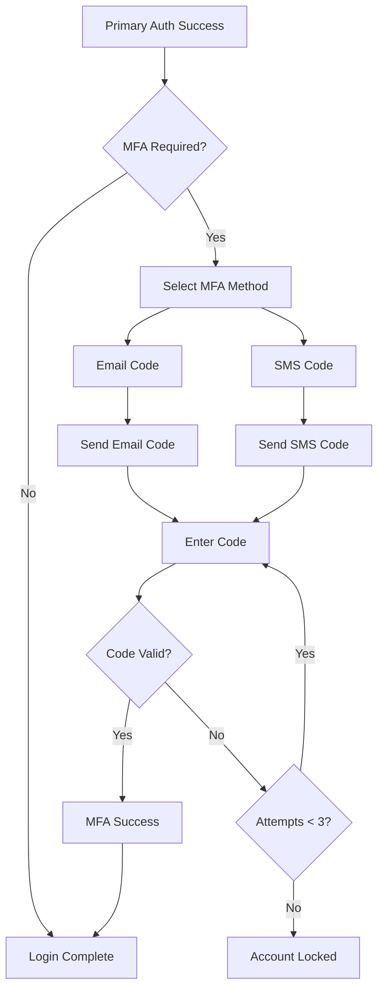

## System Overview

A modern login system must balance security, usability, and scalability. Our design focuses on providing secure authentication while maintaining excellent user experience through features like SSO, intelligent session management, and flexible verification methods.

### Core Requirements
- **Authentication Methods**: Username/password, SSO (OAuth 2.0, SAML)
- **Session Management**: 30-minute idle timeout with activity tracking
- **Multi-Factor Authentication**: Email and SMS verification codes
- **Security Features**: Rate limiting, breach detection, secure password policies
- **Scalability**: Horizontal scaling support with stateless design

**💡 Interview Insight**: When asked about system requirements, always clarify both functional and non-functional requirements. Discuss trade-offs between security and usability, and how you'd measure success metrics like authentication success rate and user satisfaction.


    A[User] --> B[Load Balancer]
    B --> C[API Gateway]
    C --> D[Authentication Service]
    C --> E[Session Service]
    C --> F[MFA Service]
    
    D --> G[User Database]
    D --> H[Identity Provider]
    E --> I[Session Store]
    F --> J[Notification Service]
    
    K[Monitoring] --> D
    K --> E
    K --> F


## Authentication Architecture

### Core Components

#### 1. Authentication Service
The central authentication service handles credential validation, token generation, and user identity management.


    participant U as User
    participant F as Frontend
    participant A as Auth Service
    participant D as Database
    participant S as Session Store
    
    U->>F: Login Request
    F->>A: POST /auth/login
    A->>D: Validate Credentials
    D-->>A: User Data
    A->>S: Create Session
    S-->>A: Session ID
    A-->>F: JWT + Session Cookie
    F-->>U: Login Success


#### 2. Token Strategy
We implement a dual-token approach for enhanced security:

- **Access Token (JWT)**: Short-lived (15 minutes), contains user claims
- **Refresh Token**: Long-lived (7 days), stored securely, enables token renewal
- **Session Cookie**: HTTP-only, secure, contains session identifier

**💡 Interview Insight**: Explain the difference between stateful and stateless authentication. Discuss when to use JWTs vs sessions, and how to handle token revocation in a distributed system. Mention the security implications of storing tokens in localStorage vs HTTP-only cookies.

### Implementation Example

```typescript
interface AuthTokens {
  accessToken: string;      // JWT with 15min expiry
  refreshToken: string;     // UUID with 7day expiry
  sessionId: string;        // Session identifier
}

interface UserSession {
  sessionId: string;
  userId: string;
  deviceInfo: DeviceInfo;
  createdAt: Date;
  lastActivity: Date;
  expiresAt: Date;
  isActive: boolean;
}
```

## Single Sign-On (SSO) Implementation

### OAuth 2.0 Flow Implementation

Our SSO implementation supports multiple identity providers (Google, Microsoft, GitHub) using the Authorization Code flow with PKCE for enhanced security.


    participant U as User
    participant A as Our App
    participant I as Identity Provider
    participant T as Token Endpoint
    
    U->>A: Click SSO Login
    A->>A: Generate PKCE Challenge
    A->>I: Redirect to Authorization
    I->>U: Login Prompt
    U->>I: Provide Credentials
    I->>A: Authorization Code
    A->>T: Exchange Code + PKCE Verifier
    T-->>A: Access Token + ID Token
    A->>A: Validate & Create Session
    A-->>U: Login Success


### SAML 2.0 Integration

For enterprise customers, we support SAML 2.0 with the following flow:


    A[User] --> B[Service Provider]
    B --> C[Identity Provider]
    C --> D[SAML Response]
    D --> B
    B --> E[Create Session]


**💡 Interview Insight**: Be prepared to explain the differences between OAuth 2.0, OpenID Connect, and SAML. Discuss when to use each protocol and how to handle attribute mapping from different identity providers. Explain the security considerations of SAML assertion handling.

### SSO Configuration Management

```typescript
interface SSOProvider {
  id: string;
  name: string;
  type: 'oauth2' | 'saml';
  clientId: string;
  clientSecret: string;
  discoveryUrl?: string;
  attributeMappings: AttributeMapping;
  isEnabled: boolean;
}

interface AttributeMapping {
  email: string;
  firstName: string;
  lastName: string;
  groups?: string[];
}
```

## Session Management & Timeout

### Intelligent Session Management

Our session management system implements sophisticated timeout logic that balances security with user experience:

#### Session Lifecycle


    [*] --> Active: Login Success
    Active --> Idle: No Activity (15 min)
    Idle --> Active: User Activity
    Idle --> Warning: Idle (25 min)
    Warning --> Active: User Confirms
    Warning --> Expired: No Response (5 min)
    Active --> Expired: Manual Logout
    Expired --> [*]


#### Implementation Details

```typescript
class SessionManager {
  private readonly IDLE_WARNING_TIME = 25 * 60 * 1000; // 25 minutes
  private readonly SESSION_TIMEOUT = 30 * 60 * 1000;   // 30 minutes
  private readonly ACTIVITY_THRESHOLD = 60 * 1000;     // 1 minute
  
  async trackActivity(sessionId: string, activityType: ActivityType): Promise<void> {
    const session = await this.getSession(sessionId);
    if (!session) return;
    
    const now = new Date();
    const timeSinceLastActivity = now.getTime() - session.lastActivity.getTime();
    
    // Only update if significant time has passed to reduce database writes
    if (timeSinceLastActivity > this.ACTIVITY_THRESHOLD) {
      await this.updateSessionActivity(sessionId, now);
      await this.logActivity(sessionId, activityType);
    }
  }
  
  async checkSessionValidity(sessionId: string): Promise<SessionStatus> {
    const session = await this.getSession(sessionId);
    if (!session) return SessionStatus.INVALID;
    
    const now = new Date();
    const timeSinceActivity = now.getTime() - session.lastActivity.getTime();
    
    if (timeSinceActivity > this.SESSION_TIMEOUT) {
      await this.expireSession(sessionId);
      return SessionStatus.EXPIRED;
    }
    
    if (timeSinceActivity > this.IDLE_WARNING_TIME) {
      return SessionStatus.IDLE_WARNING;
    }
    
    return SessionStatus.ACTIVE;
  }
}
```

**💡 Interview Insight**: Discuss the challenges of session management in a distributed system. Explain how you'd handle session synchronization across multiple servers, and the trade-offs between database-backed sessions vs in-memory storage. Address how to handle session cleanup and prevent session fixation attacks.

### Activity Tracking

We track various user activities to maintain accurate session state:

- **High-impact activities**: API calls, form submissions, navigation
- **Medium-impact activities**: Mouse movements, keyboard input
- **Low-impact activities**: Scroll events, hover states

```typescript
enum ActivityType {
  API_CALL = 'api_call',
  FORM_SUBMISSION = 'form_submission',
  NAVIGATION = 'navigation',
  USER_INPUT = 'user_input',
  HEARTBEAT = 'heartbeat'
}
```

## Multi-Factor Authentication (MFA)

### MFA Flow Design

Our MFA system supports multiple verification methods with graceful fallbacks:



### Code Generation & Validation

```typescript
class MFAService {
  private readonly CODE_LENGTH = 6;
  private readonly CODE_EXPIRY = 10 * 60 * 1000; // 10 minutes
  private readonly MAX_ATTEMPTS = 3;
  
  async generateCode(userId: string, method: MFAMethod): Promise<string> {
    const code = this.generateSecureCode();
    const expiresAt = new Date(Date.now() + this.CODE_EXPIRY);
    
    await this.storeMFACode({
      userId,
      code: await this.hashCode(code),
      method,
      expiresAt,
      attempts: 0,
      isUsed: false
    });
    
    return code;
  }
  
  async validateCode(userId: string, inputCode: string): Promise<MFAValidationResult> {
    const mfaRecord = await this.getActiveMFACode(userId);
    if (!mfaRecord) {
      return { success: false, error: 'No active MFA code found' };
    }
    
    if (mfaRecord.attempts >= this.MAX_ATTEMPTS) {
      return { success: false, error: 'Maximum attempts exceeded' };
    }
    
    if (new Date() > mfaRecord.expiresAt) {
      return { success: false, error: 'Code expired' };
    }
    
    const isValid = await this.verifyCode(inputCode, mfaRecord.code);
    await this.incrementAttempts(mfaRecord.id);
    
    if (isValid) {
      await this.markCodeAsUsed(mfaRecord.id);
      return { success: true };
    }
    
    return { success: false, error: 'Invalid code' };
  }
}
```

**💡 Interview Insight**: When discussing MFA, explain the security vs usability trade-offs. Discuss different MFA methods (TOTP, SMS, email, hardware tokens) and their relative security strengths. Address how to handle MFA backup codes and account recovery scenarios.

### Notification Services

```typescript
interface NotificationService {
  sendEmailCode(email: string, code: string): Promise<void>;
  sendSMSCode(phoneNumber: string, code: string): Promise<void>;
}

class EmailNotificationService implements NotificationService {
  async sendEmailCode(email: string, code: string): Promise<void> {
    const template = {
      subject: 'Your verification code',
      body: `Your verification code is: ${code}. This code expires in 10 minutes.`,
      html: this.generateEmailTemplate(code)
    };
    
    await this.emailProvider.send(email, template);
  }
}
```

## Security Features & Best Practices

### Password Security

#### Password Policy Implementation

```typescript
class PasswordPolicy {
  private static readonly MIN_LENGTH = 12;
  private static readonly REQUIRE_UPPERCASE = true;
  private static readonly REQUIRE_LOWERCASE = true;
  private static readonly REQUIRE_NUMBERS = true;
  private static readonly REQUIRE_SYMBOLS = true;
  private static readonly COMMON_PASSWORDS = new Set([/* ... */]);
  
  static validate(password: string): ValidationResult {
    const errors: string[] = [];
    
    if (password.length < this.MIN_LENGTH) {
      errors.push(`Password must be at least ${this.MIN_LENGTH} characters`);
    }
    
    if (this.REQUIRE_UPPERCASE && !/[A-Z]/.test(password)) {
      errors.push('Password must contain uppercase letters');
    }
    
    if (this.COMMON_PASSWORDS.has(password.toLowerCase())) {
      errors.push('Password is too common');
    }
    
    return {
      isValid: errors.length === 0,
      errors
    };
  }
}
```

### Rate Limiting & Brute Force Protection


    A[Login Attempt] --> B[Check Rate Limit]
    B --> C{Within Limit?}
    C -->|Yes| D[Process Login]
    C -->|No| E[Apply Penalty]
    D --> F{Login Success?}
    F -->|Yes| G[Reset Counter]
    F -->|No| H[Increment Counter]
    E --> I[Return Error]
    H --> J{Max Attempts?}
    J -->|Yes| K[Lock Account]
    J -->|No| L[Continue]


```typescript
class RateLimiter {
  private readonly windows = new Map<string, RateLimitWindow>();
  
  async checkLimit(identifier: string, action: string): Promise<RateLimitResult> {
    const key = `${identifier}:${action}`;
    const window = this.getOrCreateWindow(key);
    
    const now = Date.now();
    const windowStart = now - (now % window.windowSize);
    
    // Clean old attempts
    window.attempts = window.attempts.filter(
      attempt => attempt > windowStart
    );
    
    if (window.attempts.length >= window.maxAttempts) {
      const resetTime = windowStart + window.windowSize;
      return {
        allowed: false,
        resetTime,
        remainingAttempts: 0
      };
    }
    
    window.attempts.push(now);
    return {
      allowed: true,
      remainingAttempts: window.maxAttempts - window.attempts.length
    };
  }
}
```

**💡 Interview Insight**: Discuss different rate limiting strategies (fixed window, sliding window, token bucket). Explain how to implement distributed rate limiting and handle edge cases like clock skew. Address the balance between preventing attacks and not impacting legitimate users.

### Security Headers & CSRF Protection

```typescript
class SecurityMiddleware {
  static applySecurityHeaders(req: Request, res: Response, next: NextFunction) {
    res.setHeader('X-Content-Type-Options', 'nosniff');
    res.setHeader('X-Frame-Options', 'DENY');
    res.setHeader('X-XSS-Protection', '1; mode=block');
    res.setHeader('Strict-Transport-Security', 'max-age=31536000; includeSubDomains');
    res.setHeader('Content-Security-Policy', 
      "default-src 'self'; script-src 'self' 'unsafe-inline'");
    
    next();
  }
  
  static validateCSRFToken(req: Request, res: Response, next: NextFunction) {
    if (['POST', 'PUT', 'DELETE'].includes(req.method)) {
      const token = req.headers['x-csrf-token'] || req.body._csrf;
      if (!token || !this.verifyCSRFToken(token, req.session.csrfSecret)) {
        return res.status(403).json({ error: 'Invalid CSRF token' });
      }
    }
    next();
  }
}
```

## Database Design

### User Management Schema

```sql
-- Users table
CREATE TABLE users (
    id UUID PRIMARY KEY DEFAULT gen_random_uuid(),
    email VARCHAR(255) UNIQUE NOT NULL,
    password_hash VARCHAR(255),
    first_name VARCHAR(100),
    last_name VARCHAR(100),
    phone_number VARCHAR(20),
    is_active BOOLEAN DEFAULT true,
    is_verified BOOLEAN DEFAULT false,
    password_reset_token VARCHAR(255),
    password_reset_expires TIMESTAMPTZ,
    last_login TIMESTAMPTZ,
    failed_login_attempts INTEGER DEFAULT 0,
    account_locked_until TIMESTAMPTZ,
    created_at TIMESTAMPTZ DEFAULT NOW(),
    updated_at TIMESTAMPTZ DEFAULT NOW()
);

-- User sessions table
CREATE TABLE user_sessions (
    session_id VARCHAR(255) PRIMARY KEY,
    user_id UUID NOT NULL REFERENCES users(id) ON DELETE CASCADE,
    device_info JSONB,
    ip_address INET,
    user_agent TEXT,
    created_at TIMESTAMPTZ DEFAULT NOW(),
    last_activity TIMESTAMPTZ DEFAULT NOW(),
    expires_at TIMESTAMPTZ NOT NULL,
    is_active BOOLEAN DEFAULT true,
    
    INDEX idx_user_sessions_user_id (user_id),
    INDEX idx_user_sessions_expires_at (expires_at),
    INDEX idx_user_sessions_active (is_active, expires_at)
);

-- MFA codes table
CREATE TABLE mfa_codes (
    id UUID PRIMARY KEY DEFAULT gen_random_uuid(),
    user_id UUID NOT NULL REFERENCES users(id) ON DELETE CASCADE,
    code_hash VARCHAR(255) NOT NULL,
    method VARCHAR(20) NOT NULL, -- 'email' or 'sms'
    attempts INTEGER DEFAULT 0,
    is_used BOOLEAN DEFAULT false,
    expires_at TIMESTAMPTZ NOT NULL,
    created_at TIMESTAMPTZ DEFAULT NOW(),
    
    INDEX idx_mfa_codes_user_id (user_id),
    INDEX idx_mfa_codes_expires_at (expires_at)
);

-- SSO providers table
CREATE TABLE sso_providers (
    id UUID PRIMARY KEY DEFAULT gen_random_uuid(),
    name VARCHAR(100) NOT NULL,
    type VARCHAR(20) NOT NULL, -- 'oauth2' or 'saml'
    client_id VARCHAR(255),
    client_secret VARCHAR(255),
    discovery_url VARCHAR(500),
    attribute_mappings JSONB,
    is_enabled BOOLEAN DEFAULT true,
    created_at TIMESTAMPTZ DEFAULT NOW()
);

-- User SSO links table
CREATE TABLE user_sso_links (
    id UUID PRIMARY KEY DEFAULT gen_random_uuid(),
    user_id UUID NOT NULL REFERENCES users(id) ON DELETE CASCADE,
    provider_id UUID NOT NULL REFERENCES sso_providers(id) ON DELETE CASCADE,
    external_user_id VARCHAR(255) NOT NULL,
    created_at TIMESTAMPTZ DEFAULT NOW(),
    
    UNIQUE(provider_id, external_user_id),
    INDEX idx_user_sso_links_user_id (user_id)
);
```

**💡 Interview Insight**: When discussing database design, explain indexing strategies for authentication queries. Discuss partitioning strategies for large user tables and how to handle user data privacy requirements (GDPR compliance). Address database security practices like encryption at rest and in transit.

## API Design

### Authentication Endpoints

```typescript
// Authentication API specification
interface AuthAPI {
  // Basic authentication
  'POST /auth/login': {
    body: LoginRequest;
    response: LoginResponse;
  };
  
  'POST /auth/logout': {
    headers: { Authorization: string };
    response: LogoutResponse;
  };
  
  'POST /auth/refresh': {
    body: RefreshTokenRequest;
    response: TokenResponse;
  };
  
  // SSO endpoints
  'GET /auth/sso/:provider/login': {
    query: { redirect_uri?: string };
    response: RedirectResponse;
  };
  
  'POST /auth/sso/:provider/callback': {
    body: SSOCallbackRequest;
    response: LoginResponse;
  };
  
  // MFA endpoints
  'POST /auth/mfa/send-code': {
    body: SendMFACodeRequest;
    response: SendMFACodeResponse;
  };
  
  'POST /auth/mfa/verify-code': {
    body: VerifyMFACodeRequest;
    response: MFAVerificationResponse;
  };
}
```

### Request/Response Models

```typescript
interface LoginRequest {
  email: string;
  password: string;
  rememberMe?: boolean;
  deviceInfo?: DeviceInfo;
}

interface LoginResponse {
  success: boolean;
  accessToken?: string;
  refreshToken?: string;
  user?: UserProfile;
  mfaRequired?: boolean;
  mfaToken?: string;
}

interface DeviceInfo {
  deviceId: string;
  deviceName: string;
  platform: string;
  browser: string;
  ipAddress: string;
}
```

### Error Handling

```typescript
enum AuthErrorCode {
  INVALID_CREDENTIALS = 'INVALID_CREDENTIALS',
  ACCOUNT_LOCKED = 'ACCOUNT_LOCKED',
  MFA_REQUIRED = 'MFA_REQUIRED',
  INVALID_MFA_CODE = 'INVALID_MFA_CODE',
  SESSION_EXPIRED = 'SESSION_EXPIRED',
  RATE_LIMIT_EXCEEDED = 'RATE_LIMIT_EXCEEDED'
}

interface AuthError {
  code: AuthErrorCode;
  message: string;
  details?: Record<string, any>;
}
```

**💡 Interview Insight**: Discuss API design principles like RESTful conventions, proper HTTP status codes, and error handling strategies. Explain how to design APIs for both web and mobile clients, including considerations for offline functionality and progressive web apps.

## Frontend Implementation

### React Authentication Hook

```typescript
interface AuthContextType {
  user: User | null;
  isAuthenticated: boolean;
  isLoading: boolean;
  login: (credentials: LoginCredentials) => Promise<void>;
  logout: () => Promise<void>;
  refreshToken: () => Promise<void>;
}

export const useAuth = (): AuthContextType => {
  const [user, setUser] = useState<User | null>(null);
  const [isLoading, setIsLoading] = useState(true);
  
  const login = async (credentials: LoginCredentials) => {
    const response = await authAPI.login(credentials);
    if (response.mfaRequired) {
      // Handle MFA flow
      throw new MFARequiredError(response.mfaToken);
    }
    
    setUser(response.user);
    tokenManager.setTokens({
      accessToken: response.accessToken,
      refreshToken: response.refreshToken
    });
  };
  
  return { user, isAuthenticated: !!user, isLoading, login, logout, refreshToken };
};
```

### Session Timeout Handler

```typescript
class SessionTimeoutManager {
  private warningTimer?: NodeJS.Timeout;
  private logoutTimer?: NodeJS.Timeout;
  private lastActivity = Date.now();
  
  private readonly WARNING_TIME = 25 * 60 * 1000; // 25 minutes
  private readonly TIMEOUT_TIME = 30 * 60 * 1000; // 30 minutes
  
  startTracking() {
    this.resetTimers();
    this.setupActivityListeners();
  }
  
  private setupActivityListeners() {
    const events = ['mousedown', 'mousemove', 'keypress', 'scroll', 'touchstart'];
    
    const handleActivity = () => {
      const now = Date.now();
      if (now - this.lastActivity > 60000) { // Only reset if 1+ minutes since last activity
        this.lastActivity = now;
        this.resetTimers();
      }
    };
    
    events.forEach(event => {
      document.addEventListener(event, handleActivity, true);
    });
  }
  
  private resetTimers() {
    clearTimeout(this.warningTimer);
    clearTimeout(this.logoutTimer);
    
    this.warningTimer = setTimeout(() => {
      this.showTimeoutWarning();
    }, this.WARNING_TIME);
    
    this.logoutTimer = setTimeout(() => {
      this.forceLogout();
    }, this.TIMEOUT_TIME);
  }
  
  private showTimeoutWarning() {
    // Show modal warning user of impending logout
    const remainingTime = 5 * 60; // 5 minutes
    showTimeoutModal({
      remainingTime,
      onExtendSession: () => this.extendSession(),
      onLogout: () => this.forceLogout()
    });
  }
}
```

**💡 Interview Insight**: Explain the challenges of managing authentication state in single-page applications. Discuss how to handle token refresh, route protection, and the user experience during authentication flows. Address accessibility considerations for login forms and error states.

## Monitoring & Analytics

### Key Metrics to Track

```typescript
interface AuthMetrics {
  // Success metrics
  loginSuccessRate: number;
  ssoSuccessRate: number;
  mfaSuccessRate: number;
  
  // Performance metrics
  loginLatency: number;
  mfaLatency: number;
  
  // Security metrics
  failedLoginAttempts: number;
  accountLockouts: number;
  suspiciousActivities: number;
  
  // User experience metrics
  sessionDuration: number;
  timeoutOccurrences: number;
  userReturnRate: number;
}
```

### Logging & Alerting

```typescript
class AuthLogger {
  async logAuthEvent(event: AuthEvent): Promise<void> {
    const logEntry = {
      timestamp: new Date().toISOString(),
      eventType: event.type,
      userId: event.userId,
      sessionId: event.sessionId,
      ipAddress: event.ipAddress,
      userAgent: event.userAgent,
      success: event.success,
      metadata: event.metadata
    };
    
    // Log to multiple destinations
    await Promise.all([
      this.logToDatabase(logEntry),
      this.logToAnalytics(logEntry),
      this.checkForAlerts(logEntry)
    ]);
  }
  
  private async checkForAlerts(logEntry: LogEntry): Promise<void> {
    // Check for suspicious patterns
    if (logEntry.eventType === 'LOGIN_FAILED') {
      const recentFailures = await this.getRecentFailures(
        logEntry.ipAddress, 
        '5 minutes'
      );
      
      if (recentFailures.length > 10) {
        await this.sendAlert({
          type: 'BRUTE_FORCE_DETECTED',
          ipAddress: logEntry.ipAddress,
          attemptCount: recentFailures.length
        });
      }
    }
  }
}
```

**💡 Interview Insight**: Discuss the importance of comprehensive logging for security and debugging. Explain how to balance detailed logging with privacy concerns, and how to set up effective alerting for security incidents. Address compliance requirements like audit trails and data retention policies.

### Security Monitoring Dashboard


    A[Auth Events] --> B[Event Processor]
    B --> C[Real-time Analytics]
    B --> D[Alert Engine]
    B --> E[Audit Log]
    
    C --> F[Dashboard]
    D --> G[Security Team]
    E --> H[Compliance Reports]
    
    F --> I[Login Success Rate]
    F --> J[Failed Attempts]
    F --> K[Geographic Analysis]
    F --> L[Device Analysis]


## Conclusion

This comprehensive login system design provides a robust foundation for secure user authentication while maintaining excellent user experience. The system addresses modern security challenges through multi-layered defense strategies, intelligent session management, and comprehensive monitoring.

### Key Takeaways

1. **Security-First Design**: Every component considers security implications first
2. **User Experience**: Balanced security with seamless user interactions
3. **Scalability**: Designed for horizontal scaling and high availability
4. **Monitoring**: Comprehensive logging and alerting for proactive security
5. **Compliance**: Built with privacy and regulatory requirements in mind

### Next Steps for Implementation

1. Start with core authentication and session management
2. Implement basic MFA with email verification
3. Add SSO support for major providers
4. Enhance with advanced security features
5. Implement comprehensive monitoring and alerting

**💡 Final Interview Insight**: When presenting system designs, always discuss the evolution path and how you'd handle changing requirements. Explain how you'd test the system, handle edge cases, and ensure high availability. Be prepared to deep-dive into any component and explain the technical and business trade-offs made in your design decisions.

